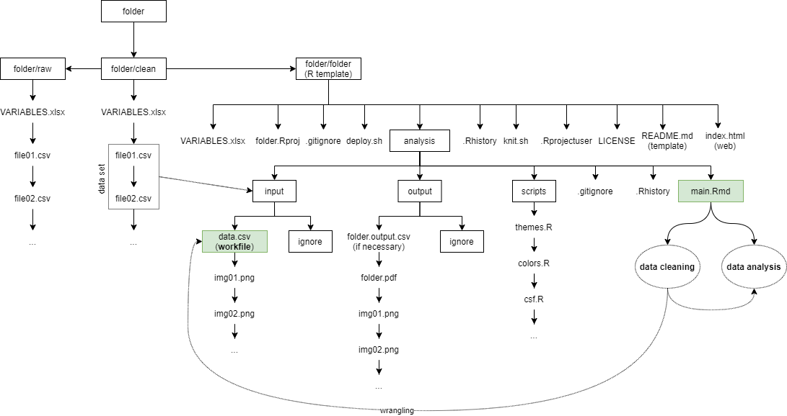
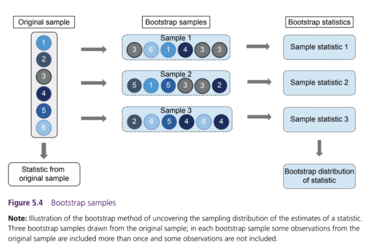

```{r, include=FALSE}
## By default, show code for all chunks in the knitted document,
## as well as the output. To override for a particular chunk
## use echo = FALSE in its options.
knitr::opts_chunk$set(
  echo = TRUE, message = FALSE, warning = FALSE
)
```

```{r, echo=FALSE}
# CONFIG
user_name <- "fernandomillanvillalobos" # your Git username (only needed if
# you want to deploy to GH pages)
project_name <- "dabep" # adapt!
package_date <- "2021-11-01" # date of the CRAN snapshot that
# the checkpoint package uses
r_version <- "4.1.2" # R-Version to use
options(Ncpus = 4) # use 4 cores for parallelized installation of packages
if (r_version != paste0(version$major, ".", version$minor)) {
  stop("ERROR: specified R version does not match currently used.")
}
```

# Notes

This report was generated on `r Sys.time()`. R version: `r paste0(version$major, ".", version$minor)` on `r version$platform`. For this report, CRAN packages as of `r package_date` were used.

...

## R-Script & Data

The preprocessing and analysis of the hotels_raw was conducted in the [R project for statistical computing](https://www.r-project.org/). The RMarkdown script used to generate this document and all the resulting hotels_raw can be downloaded [under this link](http://%60r%20user_name%60.github.io/%60r%20project_name%60/). Through executing `main.Rmd`, the herein described process can be reproduced and this document can be generated. In the course of this, hotels_raw from the folder `input` will be processed and results will be written to `output`. The html on-line version of the analysis can be accessed through this [link](https://%60r%20user_name%60.github.io/%60r%20project_name%60/).

## GitHub

The code for the herein described process can also be freely downloaded from [https://github.com/`r user_name`/`r project_name`](https://github.com/%60r%20user_name%60/%60r%20project_name%60).

## License

...

## Data description of output files

#### `abc.csv` (Example)

| Attribute | Type    | Description |
|-----------|---------|-------------|
| a         | Numeric | ...         |
| b         | Numeric | ...         |
| c         | Numeric | ...         |

#### `xyz.csv`

...

# Set up

```{r, echo=FALSE}
detach_all_packages <- function() {
  basic_packages_blank <- c(
    "stats",
    "graphics",
    "grDevices",
    "utils",
    "hotels_rawsets",
    "methods",
    "base"
  )
  basic_packages <- paste("package:", basic_packages_blank, sep = "")

  package_list <- search()[
    ifelse(unlist(gregexpr("package:", search())) == 1, TRUE, FALSE)
  ]

  package_list <- setdiff(package_list, basic_packages)

  if (length(package_list) > 0) {
    for (package in package_list) {
      detach(package, character.only = TRUE, unload = TRUE)
      print(paste("package ", package, " detached", sep = ""))
    }
  }
}

detach_all_packages()

# this allows multiple persons to use the same RMarkdown
# without adjusting the working directory by themselves all the time
source("scripts/csf.R")
path_to_wd <- csf() # if this - for some reason - does not work,
# replace with a hardcoded path, like so: "~/projects/rddj-template/analysis/"
if (is.null(path_to_wd) | !dir.exists(path_to_wd)) {
  print("WARNING: No working directory specified for current user")
} else {
  setwd(path_to_wd)
}

# suppress scientific notation
options(scipen = 999)

# suppress summarise info
options(dplyr.summarise.inform = FALSE)

# unload global rstudioapi and knitr again to avoid conflicts with checkpoint
# this is only necessary if executed within RStudio
# outside of RStudio, namely in the knit.sh script, this causes RMarkdown
# rendering to fail, thus should not be executed there
if (Sys.getenv("RSTUDIO") == "1") {
  detach_all_packages()
}
```

## Define packages

```{r echo=TRUE, message=FALSE, warning=FALSE}
# from https://mran.revolutionanalytics.com/web/packages/\
# checkpoint/vignettes/using-checkpoint-with-knitr.html
# if you don't need a package, remove it from here (commenting not sufficient)
# tidyverse: see https://blog.rstudio.org/2016/09/15/tidyverse-1-0-0/
# cat("
# library(rstudioapi)
# library(tidyverse, warn.conflicts = FALSE) # ggplot2, dplyr, tidyr, readr, purrr, tibble, magrittr, readxl
# library(scales) # scales for ggplot2
# library(jsonlite) # json
# library(desc)
# library(lintr)",
#   file = "manifest.R"
# )
```

```{r echo=TRUE, message=FALSE, warning=FALSE}
# from https://mran.revolutionanalytics.com/web/packages/\
# checkpoint/vignettes/using-checkpoint-with-knitr.html
# if you don't need a package, remove it from here (commenting not sufficient)
# tidyverse: see https://blog.rstudio.org/2016/09/15/tidyverse-1-0-0/
cat("
library(rstudioapi)
library(tidyverse, warn.conflicts = FALSE) # ggplot2, dplyr, tidyr, readr, purrr, tibble, magrittr, readxl
library(scales) # scales for ggplot2
library(jsonlite) # json
library(lintr) # code linting
library(sf)
library(rmarkdown)
library(data.table)
library(cowplot) # theme
library(extrafont)
library(waldo) # compare
library(psych) # some useful funs
library(ggrepel)
library(skimr)
library(haven)
library(Hmisc)
library(desc)
library(reshape2)
library(pastecs)
library(patchwork)
library(xtable)
library(reticulate)
library(binsreg)
library(boot)
library(modelsummary)
library(viridis)
library(grid)
library(lspline)
library(lmtest)
library(estimatr)
library(janitor)", # names
  file = "manifest.R"
)
# library(sf)
```

## Install packages

```{r, echo=TRUE, message=FALSE, warning=FALSE}
# if checkpoint is not yet installed, install it (for people using this
# system for the first time)
if (!require(checkpoint)) {
  if (!require(devtools)) {
    install.packages("devtools", repos = "http://cran.us.r-project.org")
    require(devtools)
  }
  devtools::install_github("RevolutionAnalytics/checkpoint",
    ref = "v0.3.2", # could be adapted later,
    # as of now (beginning of July 2017
    # this is the current release on CRAN)
    repos = "http://cran.us.r-project.org"
  )
  require(checkpoint)
}
# nolint start
if (!dir.exists("~/.checkpoint")) {
  dir.create("~/.checkpoint")
}
# nolint end
# install packages for the specified CRAN snapshot date
checkpoint(
  snapshot_date = package_date,
  project = path_to_wd,
  verbose = T,
  scanForPackages = T,
  use.knitr = F,
  R.version = r_version
)
rm(package_date)
```

## Load packages

```{r, echo=TRUE, message=FALSE, warning=FALSE}
source("manifest.R")
unlink("manifest.R")
sessionInfo()
```

## Load additional scripts

```{r, echo=TRUE, message=FALSE, warning=FALSE}
# if you want to outsource logic to other script files, see README for
# further information
# Load all visualizations functions as separate scripts
knitr::read_chunk("scripts/dviz.supp.R")
source("scripts/dviz.supp.R")
knitr::read_chunk("scripts/themes.R")
source("scripts/themes.R")
knitr::read_chunk("scripts/plot_grid.R")
source("scripts/plot_grid.R")
knitr::read_chunk("scripts/align_legend.R")
source("scripts/align_legend.R")
knitr::read_chunk("scripts/label_log10.R")
source("scripts/label_log10.R")
knitr::read_chunk("scripts/outliers.R")
source("scripts/outliers.R")
knitr::read_chunk("scripts/theme_bg.R")
source("scripts/theme_bg.R")
```

# CHAPTER 02: Preparing Data for Analysis

## Entity Resolution: Duplicates, Ambiguous Identification, and Non-entity Rows

One potential issue is having **duplicate observations** in the data table. In the simplest case, duplicates are perfect: the value of all variables is the same. In such cases we have to delete duplicates and leave one data row for each observation only.

A related, but conceptually different issue is to have **ambiguous identification**: the same entity having different IDs across different tables. The task here is to make sure that each entity has the same ID across data tables. That is necessary to link them properly. Entities are frequently identified by names. Unfortunately, though, names may cause issues for two main reasons: they are not unique, and different data tables may have different versions of the same name. This task is called **disambiguation**: making identification of entities not ambiguous.

Yet another issue is having non-entity observations: rows that do not belong to an entity we want in the data table. Before any meaningful analysis can be done, we need to erase such rows from the data table. The important message is this: *assigning unique IDs is important and using numerical ID variables is good practice*.

## Managing Missing Values

Having missing values for some variables is a frequent problem. There are two different main approaches: First, we can work with observations that have non-missing values for all variables used in the analysis. This is the most natural and most common approach. One version of this approach is to work with observations that make up a well-defined subsample, in which the missing data problem is a lot less severe. The second option is filling in some value for the missing values, such as the average value. This is called **imputation**. When missing values are replaced with some other values, it is good practice to create a binary variable that indicates that the original value was missing. Such a variable is called a **flag**.

When possible, focus on more fully filled variables. Imputation for qualitative variables should be done differently. We should add an additional category for missing values. For ordinal variables, we may also impute the median category and add a new variable denoting that the original value was missing.

## Organizing Data Tables for a Project

It is good practice to organize and store the data at three levels:

-   Raw data tables
-   Clean and tidy data tables
-   Workfile for analysis

**Raw data** may come in a single or in multiple files. It should be stored in the original format before anything is done to it. The next step is producing **clean** and **tidy** data from raw data. Often tidy data means multiple data tables. We should always create different data tables for data with different kinds of observations. The last of the three levels is the one on which the analysis is to be done: the **workfile**.

Project overview:



```{r ch02_hotels}
# load hotels_raw
hotels_raw <- read_csv("input/hotelbookingdata-vienna.csv")
# load hotels_clean
hotels_clean <- read_csv("input/hotels-vienna.csv")

# transform values of some variables (through splitting) into valid values
hotels_raw <- hotels_raw |>
  tidyr::separate(center1distance, c("distance", NA), sep = " ") |>
  tidyr::separate(center2distance, c("distance_alter", NA), sep = " ") |>
  tidyr::separate(accommodationtype, c(NA, "accommodation_type"), sep = "@") |>
  tidyr::separate(price_night, c(NA, NA, "nnight", NA), sep = " ") |>
  tidyr::separate(guestreviewsrating, c("rating", NA), sep = " ")
head(hotels_raw)

# check: frequency table of all values incl. missing values
tab_rating <- hotels_raw |>
  dplyr::group_by(rating) |>
  dplyr::summarise(n = n()) |>
  dplyr::mutate(
    percent = round((n / sum(n)), 3),
    cumpercent = round(cumsum(freq = n / sum(n)), 3)
  )

tab_rating_reviewcount <- hotels_raw |>
  dplyr::group_by(rating_reviewcount) |>
  dplyr::summarise(n = n()) |>
  dplyr::mutate(
    percent = round((n / sum(n)), 3),
    cumpercent = round(cumsum(freq = n / sum(n)), 3)
  )

hotels_raw <- hotels_raw |>
  dplyr::mutate(rating_count = as.numeric(rating_reviewcount))

Hmisc::describe(hotels_raw$rating_count)

# rename variables
hotels_raw <- hotels_raw |>
  dplyr::rename(
    ratingta = rating2_ta,
    ratingta_count = rating2_ta_reviewcount,
    country = addresscountryname,
    city = s_city, stars = starrating
  )


# check: key variables
tab_stars <- hotels_raw |>
  dplyr::group_by(stars) |>
  dplyr::summarise(n = n()) |>
  dplyr::mutate(
    percent = round((n / sum(n)), 3),
    cumpercent = round(cumsum(freq = n / sum(n)), 3)
  )

tab_rating <- hotels_raw |>
  dplyr::group_by(rating) |>
  dplyr::summarise(n = n()) |>
  dplyr::mutate(
    percent = round((n / sum(n)), 3),
    cumpercent = round(cumsum(freq = n / sum(n)), 3)
  )

# look for perfect duplicates
hotels_raw <- hotels_raw |>
  dplyr::arrange(hotel_id)

# filtering duplicates rows by IDs and selecting key variables to check
hotels_raw |>
  dplyr::group_by(hotel_id) |>
  dplyr::filter(n() > 1) |>
  dplyr::select(c(hotel_id, accommodation_type, price, distance, stars, rating, rating_count))

# getting rid of all duplicates (perfect duplicates)
hotels_raw <- hotels_raw |>
  dplyr::distinct()

# handling missing values in text
# checking NAs values
summary(hotels_raw)

# making a summary of the missing values
summary_wms <- t(stat.desc(hotels_raw))
summary_wms

# creating a flag variable for missing values
hotels_raw <- hotels_raw |>
  dplyr::mutate(misrating = ifelse(is.na(rating), 1, 0))

# counting all missing values
table(hotels_raw$misrating)

# looking missing values number per accomodation type
addmargins(table(hotels_raw$accommodation_type, hotels_raw$misrating))

# looking at the relation between missing values and price (mean)
hotels_raw |>
  dplyr::group_by(accommodation_type, misrating) |>
  dplyr::summarise(mean(price))

# spotting the exceptional case for "Hotels"
hotels_raw |>
  dplyr::filter((misrating == 1) & (accommodation_type == "Hotel")) |>
  dplyr::select(hotel_id, accommodation_type, price, distance, stars, rating, rating_count) |>
  dplyr::slice(1)
```

## Finding the Most Successful Managers

```{r ch02_football}
# load data
games <- read_csv("input/epl_games.csv")
team_games <- read_csv("input/epl-teams-games.csv")
managers <- read_csv("input/football_managers.csv")
merged <- read_csv("input/football_managers_workfile.csv")

dplyr::glimpse(games)
dplyr::glimpse(team_games)
dplyr::glimpse(managers)
dplyr::glimpse(merged)

# look at basic data
games <- games |>
  dplyr::arrange(team_home)

games <- games |>
  dplyr::arrange(season, team_home)

games <- games |>
  dplyr::filter(season == 2016)

# at team-game level
team_games <- team_games |>
  dplyr::arrange(team)

team_games <- team_games |>
  dplyr::arrange(season, team)

team_games <- team_games |>
  dplyr::filter(season == 2016) |>
  dplyr::arrange(date)

Hmisc::describe(merged$manager_id)

# arranging per season and team
merged <- merged |>
  dplyr::arrange(season, team)

# considering average points per game as a measure of success
# 1. looking at the number of games managed per manager
games <- merged |>
  dplyr::group_by(team, manager_id, manager_name) |>
  dplyr::summarise(manager_games = n())

# 2. adding up the points earned over a career at a team (if manager worked for two teams, we consider it two cases)
points <- merged |>
  dplyr::group_by(team, manager_id, manager_name) |>
  dplyr::summarise(manager_points = sum(points))

# 3. once we have games and points, we divide total points by the number of games
avg_points <- merge(games, points, by = c("manager_id", "team", "manager_name")) |>
  dplyr::group_by(team, manager_id, manager_name) |>
  dplyr::mutate(manager_avg_points = (manager_points / manager_games)) |>
  dplyr::arrange(manager_avg_points)

# 4. ranking the results
avg_points <- avg_points |>
  dplyr::arrange(-manager_avg_points)

# 5. looking at those with at least 2 points per game
top_managers <- avg_points |>
  dplyr::filter(manager_avg_points >= 2)

# 6. denoting caretakers (less than 18 games)
top_managers <- top_managers |>
  dplyr::mutate(
    manager_avg_points0 = ifelse(manager_games < 18, manager_avg_points, NA),
    manager_avg_points1 = ifelse(manager_games > 18, manager_avg_points, NA)
  )

# adding new variable for plotting
top_managers <- top_managers |>
  dplyr::mutate(fill = case_when(
    manager_games < 18 ~ "1",
    manager_games > 18 ~ "0"
  ))

# plotting the results
p1 <- top_managers |>
  ggplot(aes(x = reorder(manager_name, manager_avg_points), y = manager_avg_points, fill = fill, alpha = fill)) +
  geom_col(show.legend = F) +
  ylab("Average points per game") +
  xlab("Manager name") +
  scale_fill_manual(values = c(color[1], color[4])) +
  scale_alpha_manual(values = c(0.8, 0.3)) +
  scale_y_continuous(expand = c(0.01, 0.01), limits = c(0, 3), breaks = seq(0, 3, 0.3)) +
  coord_flip() +
  theme_bg() +
  cowplot::background_grid(major = "x", minor = "none")
p1
```

# CHAPTER 03: Exploratory Data Analysis (EDA)

## Frequencies and Probabilities

The **absolute frequency**, or count, of a value of a variable is simply the number of observations with that particular value in the data. The **relative frequency** is the frequency expressed in relative, or percentage, terms: the proportion of observations with that particular value among all observations in the data. If a variable has missing values, this proportion can be relative to all observations including the missing values or only to observations with missing values.

**Probability** is a general concept that is closely related to relative frequency. Probability is a measure of the likelihood of an event. In the context of data, an event is *the occurrence of a particular value of a variable*. **The probability of an event is its relative frequency.** Probabilities are always between zero and one. We denote the probability of an event as $$P(event)$$, so that $$0 <= P(event) <= 1$$. Considering a single event, it either happens or does not. These two are mutually exclusive: the probability of an event happening and it also not happening is zero: $$P(event&~even) = 0$$.

## Visualizing Distributions

Frequencies are summarized by distributions. The **distribution** of a variable gives the frequency of each value of the variable in the data, either in terms of absolute frequency (number of observations), or relative frequency (proportion or percent).

The simplest way to visualize a distribution is the **histogram**. For variables with many potential values, showing bars for each value is usually uninformative. Instead, it's better to group the many values in fewer groupings or bins. Visual inspection of a histogram can inform us about the number and location of **modes**: these are peaks in the distribution that stand out from their immediate neighborhood.

**Density plots**, also called **kernel density estimates**, are an alternative to histograms for variables with many values.

## Extreme Values

What it should be do with observations with extreme values of a variable depends on the role of the variable in our analysis. We distinguish a *y* variable and one or more *x* variables in the analysis. Typically, our analysis will aim to uncover patterns in how values of *y* tend to differ for observations that have different values of *x*. **Discarding observations with extreme *x* values narrows the scope of the comparisons.** In contrast, discarding observations with extreme *y* values changes the result of the comparisons.

```{r distributions}
# load data
vienna <- read_csv("input/hotels-vienna.csv")

# looking at the frequencies of all types of accommodation
table(vienna$accommodation_type)

# filtering accommodation: Hotel
vienna_hotels <- vienna |>
  dplyr::filter(accommodation_type == "Hotel")

# plotting distributions
# Absolute frequency (count)
p1 <- ggplot(data = vienna_hotels, aes(x = stars)) +
  geom_bar(color = color.outline, fill = color[1], alpha = 0.8, na.rm = T) +
  geom_text(stat = "count", aes(label = ..count..), vjust = -0.5, size = 2.5) +
  labs(x = "Star rating (N. stars)", y = "Frequency") +
  expand_limits(x = 0.01, y = 0.01) +
  scale_x_continuous(expand = c(0.01, 0.01), limits = c(0.5, 5.5), breaks = seq(1, 5, 0.5)) +
  scale_y_continuous(expand = c(0.00, 0.00), limits = c(0, 140), breaks = seq(0, 140, 20)) +
  theme_bg()

# Relative frequency (percent)
p2 <- ggplot(data = vienna_hotels, aes(x = stars, y = (..count..) / sum(..count..))) +
  geom_bar(color = color.outline, fill = color[1], alpha = 0.8, na.rm = T) +
  geom_text(stat = "count", aes(label = round((..count..) / sum(..count..) * 100, 1)), vjust = -0.5, size = 2.5) +
  labs(x = "Star rating (N. stars)", y = "Percent") +
  expand_limits(x = 0.01, y = 0.01) +
  scale_x_continuous(expand = c(0.01, 0.01), limits = c(0.5, 5.5), breaks = seq(1, 5, 0.5)) +
  scale_y_continuous(expand = c(0.00, 0.00), limits = c(0, 0.5), breaks = seq(0, 0.5, 0.1), labels = scales::percent_format(accuracy = 1)) +
  theme_bg()

p1|p2

# filtering 3-4 stars, without 1000 euro extreme value
vienna_hotels <- vienna |>
  dplyr::filter(accommodation_type == "Hotel") |>
  dplyr::filter(stars >= 3 & stars <= 4) |>
  dplyr::filter(!is.na(stars)) |>
  dplyr::filter(price <= 1000)

table(vienna_hotels$city)
table(vienna_hotels$stars)

# plotting hotel price (different bindwidth)
p3 <- ggplot(data = vienna_hotels, aes(x = price)) +
  geom_histogram_da(type = "frequency", binwidth = 10) +
  labs(x = "Price (US dollars)", y = "Frequency") +
  expand_limits(x = 0.01, y = 0.01) +
  coord_cartesian(clip = "off") +
  scale_x_continuous(expand = c(0.01, 0.01), limits = c(0, 500), breaks = seq(0, 500, by = 50)) +
  scale_y_continuous(expand = c(0.00, 0.00), limits = c(0, 40), breaks = seq(0, 40, by = 5)) +
  theme_bg()

p4 <- ggplot(data = vienna_hotels, aes(x = price)) +
  geom_histogram_da(type = "frequency", binwidth = 40) +
  labs(x = "Price (US dollars)", y = "Frequency") +
  expand_limits(x = 0.01, y = 0.01) +
  coord_cartesian(clip = "off") +
  scale_x_continuous(expand = c(0.01, 0.01), limits = c(0, 500), breaks = seq(0, 500, by = 50)) +
  scale_y_continuous(expand = c(0.00, 0.00), limits = c(0, 40), breaks = seq(0, 40, by = 5)) +
  theme_bg()

p5 <- ggplot(data = vienna_hotels, aes(x = price)) +
  geom_histogram_da(type = "frequency", binwidth = 80) +
  labs(x = "Price (US dollars)", y = "Frequency") +
  expand_limits(x = 0.01, y = 0.01) +
  coord_cartesian(clip = "off") +
  scale_x_continuous(expand = c(0.01, 0.01), limits = c(0, 500), breaks = seq(0, 500, by = 50)) +
  scale_y_continuous(expand = c(0.00, 0.00), limits = c(0, 40), breaks = seq(0, 40, by = 5)) +
  theme_bg()

p6 <- ggplot(data = vienna_hotels, aes(x = price)) +
  geom_histogram_da(type = "frequency", binwidth = 20) +
  labs(x = "Price (US dollars)", y = "Frequency") +
  expand_limits(x = 0.01, y = 0.01) +
  coord_cartesian(clip = "off") +
  scale_x_continuous(expand = c(0.01, 0.01), limits = c(0, 500), breaks = seq(0, 500, by = 50)) +
  scale_y_continuous(expand = c(0.00, 0.00), limits = c(0, 40), breaks = seq(0, 40, by = 5)) +
  theme_bg()

(p3 | p4 | p5) / p6

# plotting distance
p7 <- ggplot(data = vienna_hotels, aes(x = distance)) +
  geom_histogram_da(type = "frequency", binwidth = 0.5) +
  labs(x = "Distance to city center (miles)", y = "Frequency") +
  expand_limits(x = 0.01, y = 0.01) +
  scale_x_continuous(expand = c(0.01, 0.01), limits = c(0, 14), breaks = seq(0, 14, by = 2)) +
  scale_y_continuous(expand = c(0.00, 0.00), limits = c(0, 61), breaks = seq(0, 60, by = 10)) +
  geom_segment(aes(x = 8.2, y = 0, xend = 8.2, yend = 60), color = color[2], size = 1) +
  # geom_segment(aes(x = 10, y = 40, xend = 8.4, yend = 40), arrow = arrow(length = unit(0.2, "cm")))+
  annotate("text", x = 11, y = 29, label = "Too far out", size = 2) +
  annotate("rect", xmin = 8.2, xmax = 14, ymin = 0, ymax = 60, fill = color[4], alpha = 0.1) +
  theme_bg()
p7

# looking at the actual place of hotels (included outside the city of Vienna)
table(vienna_hotels$city_actual)

# filtering 3-4 stars, less than 8miles from center, without 1000 euro extreme value
vienna_hotels <- vienna |>
  dplyr::filter(accommodation_type == "Hotel") |>
  dplyr::filter(stars >= 3 & stars <= 4) |>
  dplyr::filter(!is.na(stars)) |>
  dplyr::filter(price <= 1000) |> 
  dplyr::filter(city_actual == "Vienna")
```

## Summary Statistics for Quantitative Variables

While measures of central value (such as mean, median) and spread (such as range, standard deviation) are usually well known, summary statistics that measure **skewness** are less frequently used. A distribution may be skewed in two ways, having a long left tail or having a long right tail. A long left tail means having a few observations with large values with most observations having larger values. A long right tail means having a few observations with large values with most observations having smaller values. The statistic of skewness compares the mean and the median and is called the **mean-median measure of skewness**. When the distribution is symmetric, its mean and median are the same. When it is skewed with a long right tail, the mean is larger than the median. Conversely, when a distribution is skewed with a long left tail, the mean is smaller than the median. The mean-median measure of skewness captures this intuition. In order to make this measure comparable across various distributions, we use a standardized measure, dividing the difference by the standard deviation: $$ Skewness = \frac{\bar{x} - median[x]}{Std[x]}$$

```{r summary_statistics}
# CASE STUDY: Comparing Hotel Prices in Europe: Vienna vs London
# load data
hotels_europe_price <- read_csv("input/hotels-europe_price.csv")
hotels_europe_features <- read_csv("input/hotels-europe_features.csv")

# creating a working data table for analysis
hotels_europe <- dplyr::left_join(hotels_europe_price, hotels_europe_features, by = "hotel_id")

# filtering for same Vienna data we used + London same date
hotels_europe_london_viena <- hotels_europe |>
  dplyr::filter(year == 2017 & month == 11 & weekend == 0) |>
  dplyr::filter(city %in% c("Vienna", "London")) |>
  dplyr::filter(accommodation_type == "Hotel") |>
  dplyr::filter(stars >= 3 & stars <= 4) |>
  dplyr::filter(!is.na(stars)) |>
  dplyr::filter(city_actual %in% c("Vienna", "London")) |>
  dplyr::filter(price <= 600)

# looking at the mean price for both cities
hotels_europe_london_viena |>
  dplyr::group_by(city) |>
  dplyr::summarise(mean_price = mean(price), max = max(price), n = n())

# plotting the distribution of hotel price
p1 <- ggplot(data = filter(hotels_europe_london_viena, city == "Vienna"), aes(x = price)) +
  geom_histogram_da(type = "percent", binwidth = 20) +
  labs(x = "Price (US dollars)", y = "Percent", title = "Vienna") +
  scale_x_continuous(expand = c(0.01, 0.01), limits = c(0, 500), breaks = seq(0, 500, by = 100)) +
  scale_y_continuous(expand = c(0.00, 0.00), limits = c(0, 0.3), breaks = seq(0, 0.3, by = 0.1), labels = scales::percent_format()) +
  theme_bg()

p2 <- ggplot(data = filter(hotels_europe_london_viena, city == "London"), aes(x = price)) +
  geom_histogram_da(type = "percent", binwidth = 20) +
  labs(x = "Price (US dollars)", y = "Percent", title = "London") +
  scale_x_continuous(expand = c(0.01, 0.01), limits = c(0, 500), breaks = seq(0, 500, by = 100)) +
  scale_y_continuous(expand = c(0.00, 0.00), limits = c(0, 0.3), breaks = seq(0, 0.3, by = 0.1), labels = scales::percent_format()) +
  theme_bg()

(p1 | p2)

# plotting same data using density plot
p3 <- ggplot(data = hotels_europe_london_viena, aes(x = price, y = stat(density), color = city)) +
  geom_line(stat = "density", show.legend = F, na.rm = TRUE) +
  labs(x = "Price (US dollars)", y = "Density", color = "") +
  scale_color_manual(
    name = "",
    values = c(color[2], color[1]),
    labels = c("London", "Vienna")
  ) +
  scale_y_continuous(expand = c(0.0, 0.0), limits = c(0, 0.015), breaks = seq(0, 0.015, by = 0.003)) +
  scale_x_continuous(expand = c(0.01, 0.01), limits = c(0, 500), breaks = seq(0, 500, by = 100)) +
  geom_text(aes(x = 340, y = 0.0026, label = "London"), color = color[2], size = 2.5) +
  geom_text(aes(x = 170, y = 0.008, label = "Vienna"), color = color[1], size = 2.5) +
  theme_bg()
p3

# summarizing all statistics in one table
hotels_europe_london_viena_tab <- hotels_europe_london_viena |>
  dplyr::group_by(city) |>
  dplyr::summarise(
    n = length(price), mean = mean(price), median = median(price), min = min(price), max = max(price),
    sd = sd(price), skew = ((mean(price) - median(price)) / sd(price))
  )
hotels_europe_london_viena_tab

# CASE STUDY: Measuring Home Team Advantage in Football
# load data
games <- read_csv("input/epl_games.csv")

# looking at 2016/17 season only
games <- subset(games, season == 2016)

# adding a goal difference variable
games <- games |>
  dplyr::mutate(home_goaladv = goals_home - goals_away)

# summary statistics
summary(games$home_goaladv)
psych::describe(games$home_goaladv)

# plotting the distribution of the goal difference variable
p1 <- ggplot(data = games, aes(x = home_goaladv, y = (..count..) / sum(..count..))) +
  geom_histogram(
    color = color.outline, fill = theme_colors[1],
    size = 0.2, alpha = 0.8, show.legend = F, na.rm = TRUE,
    binwidth = 1
  ) +
  geom_text(stat = "count", aes(label = round((..count..) / sum(..count..) * 100, 1)), hjust = 0.5, vjust = -0.5, size = 2) +
  labs(x = "Goal difference", y = "Share of games (percent)") +
  scale_x_continuous(expand = c(0.05, 0.05), limits = c(-6, 6), breaks = seq(-6, 6, by = 1)) +
  scale_y_continuous(expand = c(0, 0), limits = c(0, 0.25), breaks = seq(0, 0.25, by = 0.05), labels = scales::percent_format(accuracy = 5L)) +
  theme_bg()
p1
```

### Tables

To produce a good table, one needs to to think about its **usage**, choose **encoding** and **scaffolding** accordingly, and may add **annotation**. One important type wants to communicate the main result, or results, of the analysis. A table of this type is called a **result table**, or a communication table. Good communication tables are focused on one message. The other main table type is the **documentation table**. Its aim is to document exploratory data analysis. Documentation tables describe the structure of the data, one or more variables, or some other features such as missing values or extreme values. Such tables are also used to summarize the results of data cleaning and restructuring processes by showing numbers of observations and statistics of important variables for the original data and the data we chose to work with.

Encoding here means what numbers to present, and in what detail. Documentation tables tend to be large and include everything that is, or may become, important. In contrast, communication tables should be simple and focused. A good practice of encoding is to show totals together with components. In a documentation table with numbers of observations in subgroups in the data, the total number of observations is usually included. Another good practice is to include the number of observations in all tables. The second question of encoding is how much detail the numbers should have in the table. Communication tables should have no more detail than necessary. Usually, documentation tables have numbers in more detail.

```{python summary_statistics_table}
# We calculated the mean, the standard deviation of the goal difference and the relative frequency of games

# importing the library
import pandas as pd

# converting R object to a python object
wms = r.games
wms.shape

# calculating the goal difference
wms["home_goaladv"] = wms["goals_home"] - wms["goals_away"]
wms.head()

# making a table to present the results
pd.DataFrame.from_dict(
    {
        "Statistics": [
            "Mean",
            "Standard deviation",
            "Percent positive",
            "Percent zero",
            "Percent negative",
            "Number of observations",
        ],
        "Value": [
            wms["home_goaladv"].describe()["mean"],
            wms["home_goaladv"].describe()["std"],
            (wms["home_goaladv"] > 0).sum() / wms["home_goaladv"].shape[0] * 100,
            (wms["home_goaladv"] == 0).sum() / wms["home_goaladv"].shape[0] * 100,
            (wms["home_goaladv"] < 0).sum() / wms["home_goaladv"].shape[0] * 100,
            wms["home_goaladv"].describe()["count"],
        ],
    }
).round(1)
```

## Theoretical Distributions

Theoretical distributions are distributions of variables with idealized properties. Instead of showing frequencies in data, they show more abstract probabilities: the likelihood of each value (or each interval of values) in a more abstract setting. That more abstract setting is a hypothetical "data" or "population", or the abstract space of the possible realizations of events.

They can be of great help when we want to understand important characteristics of variables in our data. If a variable in our data is well approximated by a theoretical distribution, we can simply attribute those properties to the variable without having to check those properties over and over. Another reason to know about theoretical distributions is that some of them are useful what happens when we want to generalize from the data we have.

The **normal distribution** is a pure theoretical construct in the sense that it was derived mathematically from another distribution, the **binomial**. Variables with a normal distribution can in principle take on any value from negative infinity to positive infinity. The histogram of the normal distribution is bell shaped, and is characterized by two **parameters**, usually denoted as $\mu$ and standard deviation $\sigma$. They refer to the mean ($\mu$) and the standard deviation ($\sigma$). A special case of the normal distribution is the **standard normal distribution**. It is a normal distribution with parameters $\mu = 0$ and $\sigma = 1$. If variable *x* is normally distributed with mean $\mu$ and standard deviation $\sigma$, its transformed version is distributed standard normal if we take out the mean and divide this difference by the standard deviation: $\frac{(x-\mu)}{\sigma}$.

It turns out that when we transform a normally distributed variable by adding or multiplying by a number, the result is another normally distributed variable, with appropriately transformed mean and standard deviation. It also turns out that when we add two normally distributed variables, the resulting variable is also normally distributed, and its mean is the sum of the means of the two original variables.

Some variables in real life are well approximated by the normal distribution. However, the normal is a bad approximation to real-life variables with extreme values. Extreme values are very unlikely in the normal distribution. Besides the absence of extreme values, symmetry is another feature of the normal distribution that makes it a bad approximation to many economic variables. Earnings, income, wealth, and firm productivity are usually asymmetrically distributed with a long right tails. One theoretical distribution that may be a better approximation to such variables is the lognormal distribution.

The **lognormal distribution** is very asymmetric, with a long right tail, potentially including many extreme values at the positive end. The lognormal distribution is derived from the normal distribution. If we take a variable that is distributed normally *(x)* and raise *e* to its power ($e^x$), the resulting variable is distributed lognormally. The old variable is the **natural logarithm** of the new variable. Because we raised *e* to the power of the original variable, the values of the resulting lognormal variable are always positive. They range between zero and positive infinity (never reaching either). By convention, the parameters of the lognormal are the mean $\mu$ and the standard deviation $\sigma$ of the original, normally distributed variable, which is the logarithm of the new variable. There are real-life variables that are approximately lognormally distributed. These include distributions of price, income, and firm size. Variables are well approximated by the lognormal if they are the result of many things multiplied together (the natural log of them is thus a sum).

```{r theoretical_distributions}
# CASE STUDY: Distributions of Body Height and Income
# load data
hrs <- read_csv("input/hrs_height_income.csv")

# parsing height var as numeric
hrs$height <- as.numeric(as.character(hrs$height))

# looking at the overall height distribution
Hmisc::describe(hrs$height)

# filtering height of women age 55-59 
filtered_women_height <- hrs |>
  dplyr::filter(age >= 55 & age < 60 & female == 1 & height > 1.3 & height < 2.1)

Hmisc::describe(filtered_women_height$height)

# plotting women height
p1 <- ggplot(filtered_women_height, aes(x = height)) +
  geom_histogram(aes(y = ..density..),
    binwidth = 0.025, boundary = min(filtered_women_height$height),
    fill = color[1], color = color.outline, alpha = 0.8, closed = "left"
  ) +
  stat_function(
    fun = dnorm, colour = color[2],
    args = with(filtered_women_height, c(mean = mean(height), sd = sd(height)))
  ) +
  scale_y_continuous("Density",
    position = "right", expand = c(0, 0), limits = c(0, 6),
    sec.axis = sec_axis(~ . * 0.025, name = "Percent", breaks = seq(0, 0.15, by = 0.025), labels = percent_format(accuracy = 0.1))
  ) +
  theme_bg() +
  xlab("Height (meters)")
p1

# filtering income of women age 55-69
filtered_women_income <-  hrs  |> 
  dplyr::filter(age >= 55 & age < 60 & female == 1 & hhincome > 1 & hhincome < 1000)

Hmisc::describe(filtered_women_income$hhincome)

# plotting income histogram
p2 <- ggplot(filtered_women_income, aes(x = hhincome)) +
  geom_histogram(aes(y = (..count..) / sum(..count..)),
    binwidth = 20, boundary = 0, closed = "left",
    fill = color[1], color = color.outline, alpha = 0.8
  ) +
  ylab("Percent") +
  xlab("Household income (thousand USD)") +
  expand_limits(x = 0.01, y = 0.01) +
  scale_x_continuous(expand = c(0.01, 0.01), limits = c(0, 1000), breaks = seq(0, 1000, by = 100)) +
  scale_y_continuous(expand = c(0.00, 0.00), limits = c(0, 0.3), breaks = seq(0, 0.3, by = 0.05), labels = scales::percent_format(accuracy = 1)) +
  theme_bg()
p2

# log of household income
filtered_women_income <- filtered_women_income |>
  dplyr::mutate(lnincome = log(hhincome))

# plotting log of household income
p3 <- ggplot(filtered_women_income, aes(x = lnincome)) +
  geom_histogram(aes(y = ..density..),
    binwidth = 0.25, boundary = 0, closed = "left",
    fill = color[1], color = color.outline, alpha = 0.8
  ) +
  stat_function(
    fun = dnorm, colour = color[2],
    args = with(filtered_women_income, c(mean = mean(lnincome), sd = sd(lnincome)))
  ) +
  scale_x_continuous(expand = c(0.01, 0.01), limits = c(0, 8), breaks = seq(0, 8, by = 1)) +
  scale_y_continuous("Density",
    position = "right", expand = c(0, 0), limits = c(0, 0.4),
    sec.axis = sec_axis(~ . * 0.25,
      name = "Percent", breaks = seq(0, 0.1, by = 0.025),
      labels = percent_format(accuracy = 0.1)
    )
  ) +
  theme_bg() +
  ylab("Percent") +
  xlab("ln(household income, thousand USD)")
p3
```

# CHAPTER 04: Comparison and Correlation

Much of data analysis is built on comparing values of a *y* variable by values of an *x* variable, or more *x* variables. Such a comparison can uncover the **patterns of association** between the two variables: whether and how observations with particular values of one variable *(x)* tend to have particular values of the other variable *(y)*.

The role of *y* is different from the role of *x*. It's the values of *y* we are interested in, and we compare observations that are different in their *x* values. This asymmetry comes from the goal of our analysis. One goal of data analysis is predicting the value of a *y* variable with the help of other variables. The prediction itself takes place when we know the values of those other variables but not the *y* variable. To predict *y* based on the other variables we need a rule that tells us what the predicted *y* value is as a function of the values of the other variables. Such a rule can be devised by analyzing data where we know the *y* values, too.

The other most frequent goal of data analysis is to learn about the effect of a **causal variable** *x* on an **outcome variable** *y*. Here, we typically are interested in what the value of *y* would be if we could change *x*.

In sum, deciding on what's *y* and what's *x* in the data is the first step before doing any meaningful analysis.

-   For prediction we want to know what value of *y* to expect for different values of various *x* variables, such $x_1$, $x_2$,...
-   For causal analysis we want to know what value of *y* to expect if we changed the value of *x*, often comparing observations that are similar in other variables $(z_1)$, $(z_2)$, ...

```{r patterns_of_association}
# CASE STUDY: Management quality and firm size: describing patterns of association
# load data
wms <- read_csv("input/wms_da_textbook.csv")

# sample selection
wms <- wms |> 
  dplyr::filter(country=="Mexico" & wave==2013 & emp_firm>=100  & emp_firm<=5000)

# summary
summary(wms$emp_firm)
Hmisc::describe(wms$emp_firm)

wms  |> 
  dplyr::select(management, emp_firm)  |> 
  dplyr::summarise_all(tibble::lst(min, max, mean, median, sd, length))

# plotting distribution of the management score
p1 <- ggplot(data = wms, aes(x = management)) +
  geom_histogram_da(binwidth = 0.25, type = "percent", boundary = 0) +
  labs(x = "Management score", y = "Percent") +
  scale_x_continuous(expand = c(0.01, 0.01), limits = c(1, 5)) +
  scale_y_continuous(expand = c(0.00, 0.00), limits = c(0, 0.25), breaks = seq(0, 0.25, by = 0.05), labels = scales::percent_format(accuracy = 1)) +
  theme_bg()
p1

# plotting the distribution of employees
p2 <- ggplot(data = wms, aes(x = emp_firm)) +
  geom_histogram_da(binwidth = 200, type = "percent") +
  labs(x = "Firm size (employment)", y = "Percent") +
  scale_x_continuous(expand = c(0.01, 0.01), limits = c(0, 5000), breaks = seq(0, 5000, by = 1000)) +
  scale_y_continuous(expand = c(0.00, 0.00), limits = c(0, 0.3), breaks = seq(0, 0.3, by = 0.05), labels = scales::percent_format(accuracy = 1)) +
  theme_bg()
p2

# creating variable log
wms$lnemp = log(wms$emp_firm)
Hmisc::describe(wms$lnemp)

# plotting the natural log of number of employees
p3 <- ggplot(data = wms, aes(x = lnemp)) +
  geom_histogram_da(binwidth = 0.25, type = "percent", boundary = 0) +
  labs(x = "Firm size (ln(employment))", y = "Percent") +
  scale_x_continuous(expand = c(0.01, 0.01), limits = c(4, 9)) +
  scale_y_continuous(expand = c(0.00, 0.00), limits = c(0, 0.2), breaks = seq(0, 0.2, by = 0.04), labels = scales::percent_format(accuracy = 1)) +
  theme_bg()
p3
```

## Conditioning

The word statisticians use for comparison is **conditioning**. When we compare the values of *y* by the values of *x*, we condition *y* on *x*. *y* is also called the **outcome variable**; *x* is also called the **conditioning (or predictor) variable**.

When data analysts want to uncover values of *y* for observations that are different in *x* but similar in *z*, they do one more step of conditioning: they compare *y* by *x* conditional on *z*. That is called **further conditioning** or a **conditional comparison**. In practice we explore conditional probabilities, conditional means, and conditional distributions.

### Conditional Probabilities

The probability of a value of a variable in a data set is its relative frequency (percentage). **Conditional probability** is the probability of one event if another event happens. The event the conditional probability is about is called the **conditional event**; the other event is called the **conditioning event**. Conditional probabilities are denoted as $P(event_1\ |\ event_2)$: the probability of $event_1$ conditional on $event_2$.

Joint probabilities are related to conditional probabilities. The **joint probability** of two events is the probability that both occur: $P(event_1\ \&\ event_2)$. When two events are mutually exclusive, their joint probability is zero (the two never happen together).

Another probability related to two events denotes the likelihood that one event or the other happens. This is the sum of the two probabilities minus their joint probability: $P(event_1\ OR\  event_2) = P(event_1) + P(event_2) - P(event_1\ \&\ event_2)$. If the two events are mutually exclusive, we subtract zero from the sum of the two probabilities.

The conditional probability can be expressed as the corresponding joint probability divided by the probability of the conditioning event: $$P(event_1\ |\ event_2) = \frac{P(event_1\ \&\ event_2)}{P(event_2)}$$ Two events are **independent** if the probability of one of the events is the same regardless of whether or not the other event occurs. In the language of conditional probabilities this means that the conditional probabilities are the same as the unconditional probabilities: $P(event_1\ |\ event_2) = P(event_1)$ and $P(event_2\ |\ event_1) = P(event_2)$. Less intuitive, but also true is that the joint probability of independent events equals the product of their individual probabilities: $P(event_1\ \&\ event_2) = P(event_1)\ X\ P(event_2)$.

In data, the events refer to values of variables. Often, the conditional variable, *y*, is a binary variable: *y = 0* or *y = 1*. Then the conditional probability is the probability that *y = 1* if *x* has some value: $P(y = 1|x = value)$. Since *y* is binary, we know the probability of *y = 0* if we know the probability of *y = 1*, be it a conditional or unconditional probability. When *x* is binary too, there are two conditional probabilities: $$P(y = 1\ |\ x = 1)$$ $$P(y = 1\ |\ x = 0)$$ With more values for either of the two variables *(y, x)*, we have more numbers to compare: $P(y = value\ |\ x = value)$. With relatively few values, visualization often helps. To visualize conditional probabilities if both *y* and *x* have few values, a good visualization is to show stacked bar charts of *y* for the values of *x*.

```{r conditional_probability}
# CASE STUDY: Management quality and firm size: describing patterns of association
# generating employment bins
wms$emp3bins <- ifelse(wms$emp_firm < 200, 1,
  ifelse(wms$emp_firm >= 200 & wms$emp_firm < 1000, 2,
    ifelse(wms$emp_firm >= 1000, 3, 100)
  )
)

Hmisc::describe(wms$emp3bins)

# converting created variable as factor
wms$emp3bins <- as.factor(wms$emp3bins)

# creating new wms for lean management
wms_lean <- wms |>
  dplyr::select(emp3bins, lean1) |>
  dplyr::group_by(emp3bins, lean1) |>
  dplyr::summarise(Count = n()) |>
  dplyr::mutate(Percent = round(Count / sum(Count), digits = 5)) |>
  dplyr::ungroup() # use |> ungroup() when do multiple times group_by

# plotting lean management
p1 <- ggplot(data = wms_lean, aes(x = emp3bins, y = Percent, fill = factor(lean1, levels = rev(unique(lean1))))) +
  geom_bar(stat = "identity", position = "fill", width = 0.6, color = "white", size = 0.5, alpha = 0.8) +
  scale_y_continuous(expand = c(0, 0), limits = c(0, 1), breaks = seq(0, 1, by = 0.2), labels = scales::percent_format()) +
  scale_x_discrete(labels = c("1" = "Small", "2" = "Medium", "3" = "Large")) +
  scale_fill_manual(values = c(color[3], color[1], color[5], color[2], color[4]), name = NULL) +
  labs(x = "Firm size (employment), 3 bins", y = "Percent", title = "Lean Management") +
  theme_bg() +
  theme(legend.position = "right")
p1

# creating new wms for performance tracking
wms_per <- wms |>
  dplyr::select(emp3bins, perf2) |>
  dplyr::group_by(emp3bins, perf2) |>
  dplyr::summarise(Count = n()) |>
  dplyr::mutate(Percent = round(Count / sum(Count), digits = 5)) |>
  dplyr::ungroup()

# plotting performance tracking
p2 <- ggplot(data = wms_per, aes(x = emp3bins, y = Percent, fill = factor(perf2, levels = rev(unique(perf2))))) +
  geom_bar(stat = "identity", position = "fill", width = 0.6, color = "white", size = 0.5, alpha = 0.8) +
  scale_y_continuous(expand = c(0, 0), limits = c(0, 1), breaks = seq(0, 1, by = 0.2), labels = scales::percent_format()) +
  scale_x_discrete(labels = c("1" = "Small", "2" = "Medium", "3" = "Large")) +
  scale_fill_manual(values = c(color[3], color[1], color[5], color[2], color[4]), name = NULL) +
  labs(x = "Firm size (employment), 3 bins", y = "Percent", title = "Performance Tracking") +
  theme_bg() +
  theme(legend.position = "right")
p2
```

### Conditional Distribution and Conditional Expectation

Just as all variables have a distribution, all *y* variables have a **conditional distribution** if conditioned on an *x* variable. The simplest case is a binary *x* when the conditional distribution of *y* is two distributions, one for each of the two *x* values.

Conditional distributions with few *x* values are best presented by visualization: for each *x* value we show stacked bar charts if *y* has few values or histograms if *y* is a quantitative variable with many values. Make sure that the histograms are fully comparable across the *x* values: most importantly, they have the same bins of *y*, and they have the same scale on the vertical axis. Comparing histograms can reveal qualitative differences in the distributions. To make quantitative comparisons, however, we need to compare statistics that summarize the important features of distributions.

The most important conditional statistics is the **conditional mean**, also known as the **conditional expectation**, which shows the mean of *y* for each value of *x*: $E[y|x]$. Note that while the overall mean of *y*, $E[y]$, is a single number in a data table, the conditional mean, $E[y|x]$, varies in the data, because it can be different values of *x*.

Analogously, we can look at conditional medians, standard deviations, and so on. Comparing box plots and violin plots is a great way to visualize conditional statistics of *y* when *x* has few values.

### Conditional Distribution and Conditional Expectation with Quantitative *x*

When the *x* is quantitative with many values, it is usually impossible or impractical to plot histograms or compute the conditional mean for each value of *x*. First, there are too many values of *x* and, typically, too few observations for each value. Second, even if we had enough observations, the resulting statistics or pictures would typically be too complex to make sense of. We have two approaches to deal with these problems. The first approach circumvents the problem of too many *x* values by reducing them through creating bins. Creating bins from *x* is not only the simplest approach, but it often produces powerful results. Usually with just three bins of *x* we can capture the most important patterns of association between a quantitative *y* and a quantitative *x*.

Visualization of conditional means of *y* for bins of *x* is called a **bin scatter**. A bin scatter is a figure with the values of the binned *x* on the horizontal axis and the corresponding conditional mean values of the binned *y* on the vertical axis. It is a good practice to visualize bin scatters with meaningful *x* values for the *x* bins. The second approach keeps *x* as it is. The most widely used tool is the **scatterplot**, which is a visualization of the **joint distribution** of two variables. The joint distribution of two variables is the frequency of each value combination of the two variables.

```{r conditional_distributions}
# CASE STUDY: Management quality and firm size: describing patterns of association
# re-coding employee bins
wms$emp3bins <- ifelse(wms$emp3bins == 1, 150,
  ifelse(wms$emp3bins == 2, 600,
    ifelse(wms$emp3bins == 3, 3000, NA)
  )
)

# summary
wms  |> 
  dplyr::select(emp_firm, emp3bins)  |> 
  dplyr::group_by(emp3bins)  |> 
  dplyr::summarise_all(tibble::lst(min, max, mean, median, sd, length))

# generating variables by mean (3 bins)
wms_mean03 <- wms  |> 
  dplyr::group_by(emp3bins)  |> 
  dplyr::summarize(management_emp3bins = mean(management))

# plotting conditional mean (3 bins of employment)
p1 <- ggplot(data = wms_mean03, aes(x = emp3bins, y = management_emp3bins)) +
  geom_point(size = 2, color = color[3], fill = color[1], shape = 21, alpha = 0.8, na.rm = T) +
  scale_y_continuous(expand = c(0.01, 0.01), limits = c(2.4, 3.4), breaks = seq(2.4, 3.4, by = 0.2)) +
  scale_x_continuous(expand = c(0.01, 0.01), limits = c(0, 3000), breaks = seq(0, 3000, by = 500)) +
  labs(x = "Firm size (employment), 3 bins", y = "Management score") +
  theme_bg()
p1

# generating employment bins of 10
wms$emp10bins <- wms$emp_firm  |>  ggplot2::cut_number(10)

# summary
wms_summary <- wms  |> 
  dplyr::select(emp_firm, emp10bins)  |> 
  dplyr::group_by(emp10bins)  |> 
  dplyr::summarise_all(tibble::lst(min, max, mean, median, sd, length))
wms_summary

# re-coding
levels(wms$emp10bins) <- wms_summary  |> 
  dplyr::pull(mean)  |> 
  round()

wms$emp10bins <- as.numeric(levels(wms$emp10bins))[wms$emp10bins]

# summary
wms  |> 
  dplyr::select(emp_firm, emp10bins)  |> 
  dplyr::group_by(emp10bins)  |> 
  dplyr::summarise_all(tibble::lst(min, max, mean, median, sd, length))

# generating variables by mean (10 bins)
wms_mean10 <- wms  |> 
  dplyr::group_by(emp10bins)  |> 
  dplyr::summarize(management_emp10bins = mean(management))

# plotting conditional mean (10 bins of employment)
p2 <- ggplot(data = wms_mean10, aes(x = emp10bins, y = management_emp10bins)) +
  geom_point(size = 2, color = color[3], fill = color[1], shape = 21, alpha = 0.8, na.rm = T) +
  scale_y_continuous(expand = c(0.01, 0.01), limits = c(2.5, 3.5), breaks = seq(2.5, 3.5, by = 0.25)) +
  scale_x_continuous(expand = c(0.01, 0.01), limits = c(0, 3500), breaks = seq(0, 3500, by = 500)) +
  labs(x = "Firm size (employment), 10 bins", y = "Management score") +
  theme_bg()
p2

# this is a simpler solution, similar looking graph (not in book):
binsreg::binsreg(wms$management, wms$emp_firm, nbins = 3)
binsreg::binsreg(wms$management, wms$emp_firm, nbins = 10)

# plotting avg score by employment
p3 <- ggplot(data = wms, aes(x = emp_firm, y = management)) +
  geom_point(color = color[1], size = 1.5, shape = 16, alpha = 0.8, show.legend = FALSE, na.rm = TRUE) +
  scale_x_continuous(expand = c(0.01, 0.01), limits = c(0, 5000), breaks = seq(0, 5000, by = 1000)) +
  scale_y_continuous(expand = c(0.01, 0.01), limits = c(1, 5), breaks = seq(1, 5, 1)) +
  labs(x = "Firm size (employment)", y = "Management score") +
  theme_bg()
p3

# creating log var
wms$lnemp <-  log(wms$emp_firm)

# plotting avg score by employment (log)
p4 <- ggplot(data = wms, aes(x = lnemp, y = management)) +
  geom_point(color = color[1], size = 1.5, shape = 16, alpha = 0.8, show.legend = FALSE, na.rm = TRUE) +
  scale_x_continuous(expand = c(0.01, 0.01), limits = c(4, 9), breaks = seq(4, 9, by = 1)) +
  scale_y_continuous(expand = c(0.01, 0.01), limits = c(1, 5), breaks = seq(1, 5, 1)) +
  labs(x = "Firm size (ln(employment))", y = "Management score") +
  theme_bg()
p4

# transforming as bin categories factor
wms$emp3bins <- as.factor(wms$emp3bins)
levels(wms$emp3bins) <- c("Small", "Medium", "Large")

# plotting boxplots
p5 <- ggplot(data = wms, aes(x = emp3bins, y = management)) +
  stat_boxplot(aes(group = emp3bins), geom = "errorbar", width = 0.5, color = c(color[2], color[1], color[3]), size = 0.5, na.rm = T) +
  geom_boxplot(aes(group = emp3bins), color = c(color[2], color[1], color[3]), fill = c(color[2], color[1], color[3]), size = 0.5, width = 0.5, alpha = 0.3, na.rm = T) +
  labs(x = "Firm size (employment), 3 bins", y = "Management score") +
  scale_y_continuous(expand = c(0.01, 0.01), limits = c(1, 5), breaks = seq(1, 5, 1)) +
  theme_bg()
p5

# plotting violin plots
p6 <- ggplot(data = wms, aes(x = emp3bins, y = management, color = emp3bins, fill = emp3bins)) +
  geom_violin(aes(group = emp3bins), size = 0.3, alpha = 0.3, trim = F, show.legend = F, na.rm = TRUE) +
  geom_boxplot(aes(group = emp3bins), color = c(color[2], color[1], color[3]), fill = c(color[2], color[1], color[3]), size = 0.5, width = 0.2, alpha = 0.3, na.rm = T) +
  labs(x = "Firm size (employment), 3 bins", y = "Management score") +
  scale_y_continuous(expand = c(0.01, 0.01), limits = c(0, 6), breaks = seq(0, 6, 1)) +
  scale_color_manual(
    name = "",
    values = c(color[2], color[1], color[3])
  ) +
  scale_fill_manual(
    name = "",
    values = c(color[2], color[1], color[3])
  ) +
  theme_bg()
p6
```

### Dependence, Covariance and Correlation

**Dependence of two variables**, also called **statistical dependence** means that the conditional distributions of one variable *(y)* are not the same when conditional on different values of the other variable *(x)*. In contrast, **independence of variables** means that the distribution of one conditional on the other is the same, regardless of the value of the conditioning variable. Dependence of *y* and *x* may take many forms, but the most important form of dependence is **mean-dependence**: the mean of *y* is different when the value of *x* is different.

The **covariance** and the **correlation coefficient** are measures of this mean-dependence. The two measures are very closely related: the correlation coefficient is the standardized version of the covariance.

The formula for the covariance between two variables *x* and *y* in a dataset with *n* observations is: $$Cov[x, y] = \frac{\sum_i(x_i -\hat x)(y_i - \hat y)}{n}$$ The correlation coefficient divides this by the product of the two standard deviations: $$Corr[x, y] = \frac{Cov[x, y]}{Std[x]Std[y]}$$ The covariance may be any positive or negative number, while the correlation coefficient is bound to be between -1 and 1. But their sign is always the same: the covariance is zero when the correlation coefficient is zero **(uncorrelated)**; the covariance is positive when the correlation coefficient is positive **(positively correlated)**; the covariance is negative when the correlation coefficient is negative **(negative correlated)**. The magnitude of the correlation coefficient shows the strength of the association: a correlation of 0.2 or less can be considered weak, and a correlation above 0.7 is usually considered strong. If two variables are independent, the covariance and the correlation coefficient are both zero.

### From Laten Variables to Observed Variables

Often, the *y* or *x* variables we have in question are abstract concepts: the quality of management of a firm, skills of an employee, health of a person...Typically, such variables are not parts of an actual dataset, and they can't be because they are too abstract. Such variables are called **latent variables**. Data analysis can help answer questions involving latent variables only by substituting observed variables for them. Those observed variables are called **proxy variables**.

Data analysis compares values of measured variables. Even if those variables are supposed to measure abstract concepts, it's never the abstract concepts themselves that we have in our data. A specific issue arises when our data contains not one but more variables that could serve as proxies to the latent variable we want to examine. The question here is how to combine multiple observed variables:

-   Use one of the observed variables
-   Take the average (or sum) of the observed variables
-   Use principal component analysis (PCA) to combine the observed variables

Using one measured variable and excluding the rest has the advantage of easy interpretation, and the disadvantage of discarding potentially useful information contained in the other variables.

Taking the average of all measured variables makes use of all information in a simple way. When all of those variables are measured using the same scale, this approach yields a combined measure with a natural interpretation. When the variables are measured at different scales, we need to bring the observed variables to the same scale, usually by standardizing them **(z-score)**. By taking a simple average of all these variables we give them equal weight. This may be a disadvantage if some of the variables are better measures of the latent variable than others.

**Principal component analysis (PCA)** is a method to give higher weights to the observable variables that are better measures. PCA finds those weights by examining how strongly they would be related with the weighted average.

```{r correlation}
# CASE STUDY: Management quality and firm size: describing patterns of association
# calculating overall correlation coefficient
cor(wms$management, wms$emp_firm, use = "complete.obs")

# looking at the most recent industry code for the firms
table(wms$sic)

# recoding industry codes
wms$industry_broad[wms$sic <= 21] <- "food_drinks_tobacco"
wms$industry_broad[wms$sic >= 22 & wms$sic <= 23 | wms$sic == 31] <- "textile_apparel_leather_etc"
wms$industry_broad[wms$sic >= 24 & wms$sic <= 27] <- "wood_furniture_paper"
wms$industry_broad[wms$sic >= 28 & wms$sic <= 30] <- "chemicals_etc"
wms$industry_broad[wms$sic >= 32 & wms$sic < 35] <- "materials_metals"
wms$industry_broad[wms$sic >= 35 & wms$sic < 37] <- "electronics"
wms$industry_broad[wms$sic == 37] <- "auto"
wms$industry_broad[wms$sic >= 38] <- "other"

table(wms$industry_broad)

# summary management
wms  |> 
  dplyr::select(management, industry_broad)  |> 
  dplyr::filter(!is.na(industry_broad))  |> 
  dplyr::group_by(industry_broad)  |> 
  dplyr::summarise(
    Min = min(management),
    Max = max(management),
    SD = sd(management),
    Median = median(management),
    n()
  )

# summary employment
wms  |> 
  dplyr::select(emp_firm, industry_broad)  |> 
  dplyr::filter(!is.na(industry_broad))  |> 
  dplyr::group_by(industry_broad)  |> 
  dplyr::summarise(
    Min = min(emp_firm),
    Max = max(emp_firm),
    SD = sd(emp_firm),
    Median = median(emp_firm),
    n()
  )

# calculating correlation per industry broad
cor <- wms  |> 
  dplyr::group_by(industry_broad)  |> 
  dplyr::summarize(COR = cor(management, emp_firm))

# creating a table with the average of all relevant variables for the latent
wms_tab <- wms  |> 
  dplyr::select(emp_firm, industry_broad, management)  |> 
  dplyr::group_by(industry_broad)  |> 
  dplyr::summarise(Mean = mean(management), Obs = n())

# adding correlation to the table
wms_tab$cor <- cor$COR

# recoding variables
wms_tab$industry_broad <- wms_tab$industry_broad  |>  dplyr::recode(
  auto = "Auto",
  chemicals_etc = "Chemicals",
  electronics = "Machinery, equipment, electronics",
  food_drinks_tobacco = "Food, drinks, tobacco",
  materials_metals = "Materials, metals",
  textile_apparel_leather_etc = "Textile, apparel, leather",
  wood_furniture_paper = "Wood, furniture, paper",
  other = "Other"
)

# adding the last row with all category
last_row <- wms_tab  |>  dplyr::summarise(Mean = mean(Mean), Obs = sum(Obs), cor = mean(cor))
last_row$industry_broad <- "All"

wms_tab <- wms_tab  |>  dplyr::add_row(
  industry_broad = last_row$industry_broad,
  Mean = last_row$Mean,
  cor = last_row$cor,
  Obs = last_row$Obs
)

# formatting the table
wms_tab <- wms_tab  |>  dplyr::select(industry_broad, cor, Mean, Obs)
wms_tab
```

# CHAPTER 05: Generalization from Data (inference)

The act of generalization is called **inference**: we infer something from our data about a more general phenomenon because we want to use that knowledge in some other situation. Inference is best broken down into two steps: _generalizing from the data to the general pattern it represents_, and _generalizing from that general pattern to the general pattern that is behind the situation we truly care about_.

The first step is **statistical inference**, which aims at generalizing to the situation that our data represents, using statistical methods. The simplest case is a random sample that represents a well-defined **population**. The **general pattern** is a more abstract concept. For our data to represent this general pattern, it is not necessary that all variables have the same distribution. Instead, we require that the specific pattern is the same. Generalizing to a general pattern that our data represents can make sense even when our data covers an entire population.

The second step is assessing the __external validity__ of the results. External validity is about whether the general pattern our data represents is the same as the general pattern that would be relevant for the situation we truly care about. If the general pattern behind the situation we care about and the data we have is the same, what we uncover from our data has high external validity for the situation we care about. If, on the other hand, the general pattern behind the situation we care about is different from the general pattern that our data represents, whatever we uncover from our data would have low external validity. External validity is best thought of as a continuum, from very high (our data represents the same general pattern we are interested in) through medium (the two general patterns are similar but not the same) to very low (the two general patterns are very different).

Assessing external validity cannot be done with statistical methods. In practice, the goal of most analyses is a quantitative summary of patterns: a __statistic__. We want to infer the __true value__ of the statistic after having computed its __estimated value__ from the actual data. The true value is the value in a population or a general pattern. Thus, external validity is about the extent to which the true value of the statistic is similar in the general pattern our data represents and the general pattern that's behind the situation we care about. The goal of statistical inference is to uncover the true value of the statistic in the general pattern, or population, that our data represents. The starting point of statistical inference is the estimated value of the statistic that we calculate from our data. It is called an estimated value because the reason for calculating it is to uncover (estimate) the true value.

```{r inference}
# CASE STUDY: What likelihood of loss to expect on a stock portfolio
# load data
sp500 <- read_csv("input/SP500_2006_16_data.csv", na = c("", "#N/A"))
# subsetting all the values that are NOT NAs
sp500 <- subset(sp500, VALUE != "NA")

# creating percent return
sp500 <- sp500 |> 
  dplyr::mutate(pct_return = (VALUE - dplyr::lag(VALUE)) / dplyr::lag(VALUE) * 100)

# creating date variable
sp500$year <- format(sp500$DATE, "%Y")
sp500$month <- format(sp500$DATE, "%m")
sp500$year <- as.numeric(sp500$year)
sp500$month <- as.numeric(sp500$month)
sp500$yearmonth <- sp500$year * 100 + sp500$month

# plotting daily returns
p1 <- ggplot(sp500, aes(pct_return)) +
  geom_histogram_da(binwidth = 0.25, type = "frequency") +
  geom_vline(xintercept = -5, size = 0.7, color = color[2]) +
  labs(x = "Daily return (percent)", y = "Frequency") +
  coord_cartesian(xlim = c(-10, 10), ylim = c(0, 400)) +
  scale_y_continuous(expand = c(0, 0)) +
  geom_segment(aes(x = -6, y = 220, xend = -5, yend = 220), arrow = arrow(length = unit(0.1, "cm"))) +
  annotate("text", x = -8, y = 220, label = "5% loss", size = 2.5) +
  theme_bg()
p1
```

## Repeated Samples, Sampling Distribution and Standard Error (SE)

The conceptual background to statistical inference is __repeated samples__. The basic idea is that the data we observe is one example of many data sets that could have been observed. Each of those potentially observed data sets can be viewed as a sample drawn from the population, or the more abstract general pattern.

The goal of statistical inference is learning the value of a statistic in the population, or general pattern, represented by our data. With repeated samples, the statistic has a distribution: its value may differ from sample to sample. Within each sample the calculated value of statistic is called an __estimate__ of the statistic. The distribution of the statistic is called its __sampling distribution__. The sampling distribution of a statistic shows the values that the estimated statistic takes across repeated samples. The most important aspect of this sampling distribution is its standard deviation: how much spread there is across repeated samples. The standard deviation of the sampling distribution has a specific name: the __standard error (SE)__ of the statistic ($se(\bar X) = \frac{\sigma}{\sqrt N}$)

The sampling distribution has three important properties:

1. The average of the values in repeated samples is approximately equal to its true value (the value of the entire population, or general pattern, represented by our data.) -> __unbiasedness__
2. The sampling distribution is approximately normal. -> __approximate normality__
3. The standard error is smaller the larger the sample, with a proportionally factor of the square root of the sample size. -> __root-n convergence__

Because the sampling distribution is approximately normal, we know that the measured values fall within plus or minus two standard errors (SE) of the truth approximately 95% of the time. Similarly, we know that they fall within plus or minus 1.6 SE of the truth with a 90% chance, and within 2.6 SE with a 99% chance.

```{r standard_error}
# CASE STUDY: What Likelihood of Loss to Expect on a Stock Portfolio?
# Create 10 000 samples, with 500 and 1000 observations in each sample, taken from sp500
# remove first row as it has NA in pct_return
pct_return <- sp500  |> 
  dplyr::filter(!is.na(pct_return))  |> 
  dplyr::pull(pct_return)

# function for a specified number of samples: draws a specified number of observations from a vector, calculates the percentage of obs with greater than 5% losses 
# 3 inputs: 'vector' is a vector of the source data, in this case pct_return. 'n_samples' is the number of samples we want to use. 
# 'n_obs' is the number of observations in each sample
# output is a vector
create_samples <- function(vector, n_samples, n_obs) {
  samples_pcloss <- c()
  for (i in 1:n_samples) {
    single_sample <- sample(vector, n_obs, replace = FALSE)
    samples_pcloss[i] <- sum(single_sample < -5) / n_obs * 100
  }
  samples_pcloss
}

set.seed(123)

# creating samples
nobs_1000 <- create_samples(pct_return, 10000, 1000)
nobs_500 <- create_samples(pct_return, 10000, 500)

# converting results as tibble
nobs_df <- tibble(nobs_500,nobs_1000)

# calculating the se
se <- qnorm(0.95) * sd(nobs_df$nobs_1000) / sqrt(length(nobs_df$nobs_1000))

# calculating CI
left <- mean(nobs_df$nobs_1000) - se
right <- mean(nobs_df$nobs_1000) + se

# plotting simulated number of days with big losses
options(digits = 2)

p2 <- ggplot(nobs_df, aes(nobs_1000)) +
  geom_histogram(binwidth = 0.1, color = color.outline, fill = color[1], alpha = 0.8, boundary = 0, closed = "left") +
  labs(x = "Percent of days with losses of 5% or more", y = "Frequency") +
  geom_vline(aes(xintercept = mean(nobs_1000)), color = color[2], size = 0.7) +
  coord_cartesian(xlim = c(0, 1.5), ylim = c(0, 2500)) +
  scale_x_continuous(expand = c(0.01, 0.01), limits = c(0, 1.5), breaks = seq(0, 1.5, by = 0.25)) +
  scale_y_continuous(expand = c(0.00, 0.00), limits = c(0, 2500), breaks = seq(0, 2500, by = 500)) +
  geom_segment(aes(x = 0.8, y = 2000, xend = 0.53, yend = 2000), arrow = arrow(length = unit(0.1, "cm"))) +
  annotate("text", x = 0.85, y = 2000, label = "Mean", size = 2.5) +
  theme_bg()
p2

# comparing density for both simulations
p3 <- ggplot(nobs_df, aes(nobs_1000)) +
  stat_density(geom = "line", aes(color = "n1000"), bw = 0.45, size = 1, kernel = "epanechnikov") +
  stat_density(geom = "line", aes(nobs_500, color = "n500"), bw = 0.45, linetype = "twodash", size = 1, kernel = "epanechnikov") +
  labs(x = "Percent of days with losses over 5%", y = "Density") +
  geom_vline(xintercept = 0.5, colour = color[3], size = 0.7, linetype = "dashed") +
  geom_segment(aes(x = 0.9, y = 0.72, xend = 0.65, yend = 0.72), size = 0.5, arrow = arrow(length = unit(0.1, "cm"))) +
  annotate("text", x = 1.1, y = 0.72, label = "Larger sample", size = 2) +
  geom_segment(aes(x = 0.9, y = 0.68, xend = 0.65, yend = 0.68), size = 0.5, arrow = arrow(length = unit(0.1, "cm"))) +
  annotate("text", x = 1.1, y = 0.68, label = "Smaller sample", size = 2) +
  scale_x_continuous(expand = c(0.01, 0.01), limits = c(0, 1.5), breaks = seq(0, 1.5, by = 0.25)) +
  scale_y_continuous(expand = c(0.00, 0.00), limits = c(0, 0.8), breaks = seq(0, 0.8, by = 0.2)) +
  scale_color_manual(name = "", values = c(n1000 = color[1], n500 = color[2])) +
  theme_bg() +
  theme(legend.position = "none")
p3

# plotting histogram of big loss simulations with N = 500 and N = 1000
p4 <- ggplot(data = nobs_df) +
  geom_histogram(aes(x = nobs_500, y = (..count..) / sum(..count..) * 100, color = "n500", fill = "n500"), binwidth = 0.2, boundary = 0, closed = "left", alpha = 0.7) +
  geom_histogram(aes(x = nobs_1000, y = (..count..) / sum(..count..) * 100, color = "n1000", fill = "n1000"), binwidth = 0.2, boundary = 0, closed = "left", alpha = 0.1, size = 0.7) +
  ylab("Percent") +
  xlab("Percent of days with losses over 5%") +
  scale_x_continuous(expand = c(0.01, 0.01), limits = c(0, 1.6), breaks = seq(0, 1.6, by = 0.2)) +
  scale_y_continuous(expand = c(0.00, 0.00), limits = c(0, 50)) +
  scale_color_manual(name = "", values = c(color[2], color[1])) +
  scale_fill_manual(name = "", values = c(color[2], color[1])) +
  theme_bg() +
  theme(
    legend.position = c(0.7, 0.9),
    legend.key.size = unit(x = 0.4, units = "cm"),
    legend.direction = "horizontal"
  )
p4

# looking at distribution in a table
janitor::tabyl(nobs_df$nobs_500, sort = TRUE)
janitor::tabyl(nobs_df$nobs_1000, sort = TRUE)
```

## The Confidence Interval

The __confidence interval (CI)__ is the most important measure of statistical inference. The idea of the CI is to give us a range, in which we can expect the true value to lie with a certain probability. That probability is something data analysts need to pick. Typical probability picks are 95% or 90%.

The confidence interval is constructed as a symmetric range around the estimated value of the statistic in our data. We first calculate the estimated value of the statistic in our data. Then we specify the length of the CI on the two sides of the estimated value. We use the SE to know the length of the appropriate CI. The SE is the general unit of measurement when constructing confidence intervals. The appropriate 95% CI is the $\pm2$ SE or, more precisely, 1.96 SE interval around the estimate from the data. The appropriate 90% CI is the $\pm1.6$ SE interval around the estimate from the data; and the appropriate 99% CI is the $\pm2.6$ SE interval around it.

## Estimating the Standard Error with the Bootstrap Method

The __bootstrap__ is a method that creates the sampling distribution across repeated samples that are representative of the same population, or general pattern, as the original data and also have the same size. The bootstrap method takes the original data and draws many repeated samples of the size of that data. The trick is that the samples are drawn with replacement. The observations are drawn randomly one by one from the original data; once an observation is drawn it is "replaced" into the pool so that it can be drawn again, with the same probability as any other observation. The drawing stops when the sample reaches the size of the original data. The result is a sample of the same size as the original data, yielding a single __bootstrap sample__. This bootstrap sample includes some of the original observations multiple times, and it does not include some of the other original observations. The distribution of a statistic across these repeated bootstrap samples is a good approximation to the sampling distribution that would look like across samples similar to the original data.


The bootstrap method works if the variable we consider is independent across observations. By sampling observations one by one and then replacing them into the pool to be possibly drawn again, we destroy the before-after relationships in the original data. That is not a problem if there is no relationship across observations, which is true in most cross-sectional data.

Since the distribution of a statistic across bootstrap samples is a good approximation of the sampling distribution, it gives a good approximation of the standard error, too. The __bootstrap estimate of the standard error__ is the standard deviation of the estimated values of the statistic across the bootstrap samples. Once we have the standard error, we have everything we need for constructing the confidence interval of our choice.

The bootstrap method have its limitations, on top of the independence, it tends to provide very poor standard error estimates in the presence of extreme values. Moreover, it may produce poor standard error estimates in small samples if the statistic is not the mean but the median or some other quantile.

```{r bootstrap-se}
# CASE STUDY: What Likelihood of Loss to Expect on a Stock Portfolio?
set.seed(573164)

M <- 10000

Results <- matrix(rep(0, (M * 10)), nrow = M, ncol = 10)

for (i in 1:M) {
  bsample <- sample(sp500$pct_return, size = dim(sp500)[1], replace = TRUE)

  for (j in 1:10) {
    loss <- as.numeric(bsample < (-j)) * 100
    Results[i, j] <- mean(loss, na.rm = T)
  }
}

Results <- as_tibble(Results)
names(Results) <- c(
  "loss1", "loss2", "loss3", "loss4", "loss5", "loss6",
  "loss7", "loss8", "loss9", "loss10"
)

p1 <- ggplot(Results, aes(loss5)) +
  geom_histogram_da(type = "frequency", binwidth = 0.04, boundary = 0, closed = "left") +
  scale_y_continuous(expand = c(0, 0), limits = c(0, 1200), breaks = seq(0, 1200, 200)) +
  scale_x_continuous(expand = c(0.01, 0.01), limits = c(0, 1.2), breaks = seq(0, 1.2, 0.1)) +
  labs(x = "Percent of days with losses of 5% or more", y = "Frequency") +
  theme_bg()
p1
```
## The Standard Error Formula

There is a relatively simple formula for the standard error (SE) of the average ($\bar x$). The formula includes the root-n factor and just one another element. $\bar x$ is the estimate of the true mean value of _x_ in the general pattern (or the population).

The __standard error formula__ for $\bar x$ is $$SE(\bar x) = \frac{1}{\sqrt n} Std[x]$$ where $Std[x]$ is the standard deviation of the variable in the data, and _n_ is the number of observations in the data. The standard error is larger, the smaller the sample and the larger the standard deviation of the variable.

```{r se-formula}
# CASE STUDY: What Likelihood of Loss to Expect on a Stock Portfolio?
# using the psych package to figure out the sd = 0.07
psych::describe(sp500$pct_return > -5)

# calculating the denominator of the SEM formula = 0.02
x <- sqrt((1 / 2519))

# calculating the product of both operations -> 0.02 * 0.07 = 0.0014 (0.14%) or the standard error of the mean
sem <- x * 0.07
sem

# calculating the 95% CI
right <- 0.5 + 2 * 0.14
left <- 0.5 - 2 * 0.14
c(left, right)
```

## External Validity

The confidence interval summarizes uncertainty about the true value of the statistics in the population, or the general pattern, that our data represents. An important part in inference is defining the population, or general pattern, we care about (the future), and assessing how close it is to the population, or general pattern, our data represents (the past). __External validity__ is the concept that captures the similarity of those two general patterns. 

With _high_ external validity, the confidence interval captures all uncertainty about our estimate. With _low_ external validity, it does not. To assess external validity we need substantive knowledge of the situation. The most important challenges to external validity may be collected in three groups: __time__, __space__, and __sub-groups__. 

First, _stability in time_. The data we analyze is always from the past, whereas the situation we care about is almost always in the future. Thus, in order to generalize from the data, we need to assume that the general pattern that was relevant in the past will remain relevant for the future. A specific issue with time is the occurrence of extreme values. Our data may be free of extreme values because some very rare extreme events may not have happened in the historic period that our data represents. However, this does not imply that such a rare extreme event could not happen in the future we care about.

Second, _stability through space_. The data we analyze may come from a different country, region, or city than the situation we care about.

Third, _stability across subgroups_. A pattern may be strong among one group of people, but it may not be there for people in different professional, age, gender, cultural, or income groups.

# CHAPTER 06: Testing Hypotheses

A hypothesis is a statement about a population, or general pattern. Testing a hypothesis amounts to gathering information from a dataset and, based on that information, deciding whether that hypothesis is false or true in the population, or general pattern. Thus, __hypothesis testing__ means analyzing the data at hand to make a decision about the hypothesis. Two decisions are possible: rejecting the hypothesis or not rejecting it. We reject the hypothesis if there is enough evidence against it. We don't reject it if there isn't enough evidence against it. We may have insufficient evidence against a hypothesis either if the hypothesis is true or if it is not true but the evidence is weak.

Testing a hypothesis is a way of making an inference, with a focus on a specific statement. As with any kind of inference, we have to assess external validity. The first step is defining the statistic that would answer our question. Often that statistic is an _average_, or the _difference between two average_ values.

```{r dist-online-offline}
# CASE STUDY: Comparing Online and Offline Prices: Testing the Difference
pd <- read.csv("input/online_offline_ALL_clean.csv")

# filter the data
pd <- pd |>
  filter(COUNTRY == "USA") |>
  filter(PRICETYPE == "Regular Price") |>
  filter(is.na(sale_online)) |>
  filter(!is.na(price)) |>
  filter(!is.na(price_online))

# drop errors (+1000 dollars)
pd <- pd |> filter(price < 1000)

# creating diff variable
pd <- pd |> mutate(diff = price_online - price)

# Check the main descriptives
modelsummary::datasummary(diff ~ Mean + SD + Min + Max + Median + Max, data = pd)

# plotting online-offline price differences
p1 <- ggplot(data = pd, aes(diff)) +
  geom_histogram(
    binwidth = 5, boundary = 0, closed = "left",
    fill = color[1], size = 0.25, alpha = 0.8, show.legend = F, na.rm = TRUE
  ) +
  labs(x = "Online - offline price difference (US dollars)", y = "Frequency") +
  theme_bg() +
  scale_x_continuous(limits = c(-420, 420), breaks = seq(-400, 420, by = 100)) +
  scale_y_continuous(limits = c(0, 6000), breaks = seq(0, 6000, by = 1000), expand = c(0.01, 0.01)) +
  geom_segment(aes(x = 300, y = 500, xend = 415, yend = 20), arrow = arrow(length = unit(0.1, "cm"))) +
  annotate("text", x = 300, y = 700, label = "max value= 415", size = 2.5) +
  geom_segment(aes(x = -280, y = 500, xend = -380, yend = 20), arrow = arrow(length = unit(0.1, "cm"))) +
  annotate("text", x = -300, y = 700, label = "min value= -380", size = 2.5)
p1

# 4.99999 not 5 -- needed because of data imported from stata may be stored wierdly. 
# pd1 <- subset(pd, abs(pd$diff) < 4.999999)
# Hmisc::describe(pd1$diff)

# plotting online-offline price differences (+-5 dollar price difference) 
p2 <- ggplot(data = pd, aes(diff)) +
  geom_histogram(
    binwidth = 0.5, boundary = -0, closed = "left",
    color = color.outline, fill = color[1], size = 0.25, alpha = 0.8, show.legend = F, na.rm = TRUE
  ) +
  labs(x = "Online - offline price difference (US dollars)", y = "Frequency") +
  theme_bg() +
  expand_limits(x = 0.01, y = 0.01) +
  scale_x_continuous(limits = c(-5, 5), breaks = seq(-5, 5, by = 1)) +
  scale_y_continuous(expand = c(0.00, 0.00), limits = c(0, 5000), breaks = seq(0, 5000, by = 1000))
p2

p1 | p2   
```
## Null Hypothesis, Alternative Hypothesis

After specifying the statistic that helps answer our question, we need to state two competing hypotheses, of which only one can be true. The first one is the __null hypothesis__ ($H_0$), the second one is the __alternative hypothesis__ ($H_1$). These hypotheses are formulated in terms of the unknown __true value__ of the statistics. Together, the null and the alternative should cover all possibilities we are interested in. $$H_0: s_{true}  = 0 \\ H_1: s_{true} \not =  0$$

The case when we test if $H_1 : s_{true} \not = 0$ is called __two-sided alternative__ as it allows for $s_{true}$ to be either greater than zero or less than zero. The other case is working with a __one-sided alternative__, when we are indeed interested if a statistic is positive. $$H_0 : s_{true} \le 0 \\ H_1 : s_{true} \gt 0$$

## The t-Test

Following the logic of hypothesis testing, when we look at the evidence to see if we want to reject the null or maintain our assumption that it's true, the evidence we look for is how far the estimated value of the statistic is from zero, its hypothesized value. We reject the null if the estimate is large, and we do not reject it if the estimate is not very far. How far is far enough for rejecting requires a measure of the distance -> the __t-statistic__. More generally, the t-statistic is a __test statistic__. __A test statistic is a measure of the distance of the estimated value of the statistic from what its true value would be if $H_0$ were true__.

Consider $H_0: s_{true} = 0$ , $H_1: s_{true} \not =  0$, where $s$ is an average, or the difference of that average from a number, or a difference of two averages. The null and alternative are about the true value of the statistic: $s_{true}$. Our data contains information to compute the estimated value of the statistic: $\hat{s}$. The t-statistic for this hypotheses uses the estimated value $\hat{s}$ and its standard error: $$t = \frac{\hat{s}}{SE(\hat{s})}$$ When $\hat{s}$ is the average of a variable _x_, the t-statistic is simply $$t = \frac{\bar{x}}{SE(\bar{x})}$$ When $\hat{s}$ is the average of a variable _x_ minus a number, the t-statistic is $$t = \frac{\hat{x} - number}{SE(\hat{x})}$$ When $\hat{s}$ is the difference between two averages, say, $\bar{x}_A$ and $\bar{x}_B$, the t-statistic is $$t = \frac{\bar{x}_A - \bar{x}_B}{SE(\bar{x}_A - \bar{x}_B)}$$

The sign of the t-statistic is the same as the sign of $\hat{s}$. If $\hat{s}$ is positive, the t-statistic is positive; if $\hat{s}$ is negative, the t-statistic is negative. The magnitude of the t-statistic measures the distance of $\hat{s}$ from what $s_{true}$ would be if the null were true. The unit of distance is the standard error.

## Making a Decision; False Negatives, False Positives

In hypothesis testing the decision of rejecting the null or not rejecting it is based on a clear rule specified in advance. To be specific, the decision rule in statistical testing is comparing the test statistic to a __critical value__. The critical value thus tell us whether the test statistic is large enough to reject the null. To be transparent, we need to set the critical value before looking at the test statistic, but the practice is to use a commonly accepted critical value. The critical value reflects a preference for how conservative we want to be with the evidence.

We can make one of two decisions with hypothesis testing: we reject the null or we don't reject the null. That decision may be right or wrong. We say that our decision is a __false positive__ (Type-I error) if we reject the null when it is true, and a __false negative__ (Type-II error) if we do not reject the null even though it's not true. False positives and false negatives are both wrong, but they are not equally wrong. The way we set up the null and the alternative, wrongly rejecting the null is a bigger mistake than wrongly accepting it. Therefore, the critical value is to be chosen in a way that makes false positives rare.

Talking about a t-test for a null with a two-side alternative, a commonly applied critical value for a t-statistic is $\pm2$: reject the null if the t-statistic is smaller than -2 or larger than +2; don't reject the null if the t-statistic is between -2 and +2. That way the probability of a false positive is 5%. Based on the same argument, we can set other critical values that correspond to different probabilities of a false positive. If we make the critical values -2.6 and +2.6, the chance of a false positive is 1%. With critical values -1.6 and +1.6 it is 10%. Data analysts avoid biases using the same $\pm2$ critical value of the t-test regardless of the data and hypothesis they are testing.

The chance of a false negative depends on two things: how far the true value is from the value defined in the null hypothesis, and how large the sample is. The probability of a false positive is called the __size of the test__. The maximum probability that we tolerate is the __level of significance__. When we fix the level of significance at 5% and end up rejecting the null, we say that the statistic we tested is significant at 5%. The probability of avoiding a false negative is the __power of the test__. Thus, we usually fix the level of significance at 5% and hope for a high power, which is more likely the larger the sample and the further away the true value is from what's in the null. Tests with more observations are more power in general.

## The p-Value

The __p-value__ informs us about the probability of a _false positive_. To be more precise, the p-value is the probability that the test statistic will be as large as, or larger than, what we calculate from the data, _if the null hypothesis is true_. Thus, the p-value is the smallest significance level at which we can reject $H_0$ given the value of the test statistic in the data. Because the p-value tells us the smallest level of significance at which we can reject the null, it summarizes all the information we need to make the decision.

```{r t-statistic}
# CASE STUDY: Comparing Online and Offline Prices: Testing the Difference
t.test(pd$diff, mu = 0)
```
Conclusion: The t-statistic (0.4) is well within $\pm2$, thus we can't reject the hypothesis that the average price difference is zero in the population of products represented by the data. Doing so would be inconsistent with our goal to keep the probability of false positive below 5%. 

We arrive at the same conclusion with the help of the p-value (0.7). That means that there is a 66% chance that we could observe a price difference of this magnitude (or a larger one) if the null is true. It also means that the smallest level of significance at which we could reject the null is 66%, well over the 5% level of significance we have chosen.

Finally, we would arrive to a similar conclusion if we just looked at the 95% CI of the average price difference. The CI contains zero. So the value of the true average price difference may very well be zero. It also shows that it's very unlikely that the true average price is more than +0.30 or -0.19 cents.


## Steps of Hypothesis Testing

1. Define the __statistic__ that corresponds to your question.
2. Initial assessment of __external validity__: general pattern of interest, general pattern represented by the data.
3. State the __null__ and __alternative__ hypotheses.
4. Choose a __critical value__. In practice, that should correspond to 5%.
5. Calculate the __test statistic__ from the data.
6. Make a decision based on the calculated test statistic and the critical value.
7. Alternative to steps 4-6, calculate the __p-value__ and make a decision by comparing it to a pre-set level of significance that in practice will usually be 5%.
8. Interpret the results.
9. Final assessment of external validity. Would the same decision be fine for the population, or general pattern, of interest

## One-Sided Alternatives

Testing a null hypothesis against a one-sided alternative means having an inequality in the null hypothesis instead of an equality: $H_0:s_{true}  \le 0$ against $H_1:s_{true} \gt 0$ and $H_0:s_{true}  \ge 0$ against $H_1:s_{true} \lt 0$. Having only one of the inequalities leads to focusing on one side of the test statistic only. Focusing on deviations in one direction means that we care about one half of the sampling distribution of the test statistic.

The probability of a false positive is smaller in this case. We don't reject the null if the test statistic falls in the region that is specified in the null hypothesis. Thus, we make a false positive decision only half of the time. The probability of a false positive decision here is therefore half of the probability of a false positive in the corresponding two-sided test.

Therefore, the practical way to test a one-sided hypothesis is a two-step procedure.

1. If the test statistic is in the region of the null, don't reject the null. This happens if $\hat s$ is in the region of null ($H_0:s_{true}  \le 0$ against $H_1:s_{true} \gt 0$).
2. If the test statistic is in the region of the alternative, calculate the p-value of the null hypothesis of the equality and divide the p-value by two.

## Testing Multiple Hypotheses

The simplest decision rule to testing a hypothesis consists of calculating a p-value from the data and comparing it to a pre-set level of significance. So far, we have considered cases with one pair of hypotheses: a null and an alternative. Often, though, data analysis involves testing multiple null hypotheses, each with and an alternative. Testing multiple hypotheses is an issue because the statistical theory of testing, and the corresponding tools, have been developed for testing a single null hypothesis. In multiple hypothesis testing, the question is the likelihood that any one of the true nulls will be wrongfully rejected.

```{r testing-multiple-hypotheses}
# CASE STUDY: Comparing Online and Offline Prices: Testing the Difference
# calculating multiple hypotheses for each retailer in the data (16)
spd <- split(pd, pd$retailer, drop = FALSE)
out <- vector("list", length = length(spd))
out <- lapply(1:length(spd), function(x) out[[x]] <- t.test(spd[[x]]$diff, mu = 0))
out

# creating a table with the 16 p-values if we carry out each test one by one
table_out <- pd |>
  group_by(retailer) |>
  group_modify(~ tidy(t.test(.x$diff)))
table_out <- table_out |>
  dplyr::select(retailer, estimate, p.value)
table_out
```
# CHAPTER 07: Simple Regression

We focus in the most important pattern of association: __mean dependence__. Mean-dependence tells whether, and to what extent, the mean of _y_ is different when the value of _x_ is different. __Regression__ is the most widely used method of comparison in data analysis. __Simple regression analysis__ uncovers mean-dependence between two variables. It amounts to comparing average values of one variable, called the dependent variable _(y)_ for observations that are different in the other variable, the explanatory variable _(x)_. Discovering patterns of association between variables if often a good starting point if we are interested in __causal analysis__: uncovering the effect of one variable on another variable; or, we may be interested in __predictive analysis__: what to expect of a variable for various values of another variable.

__Regression analysis__ is a method that uncovers the average value of a variable _y_ for different values of variable _x_. Regression is a model for the __conditional mean__. The model for the conditional mean gives a rule that takes _x_ values and tells what the mean value of _y_ is. $$E[y|x] = f(x) *  \\ y^E = f(x) \\ y = f(x) + e **$$

\* The expected value of _y_ conditional on _x_ is given by the function _f_.

\** The actual value of _y_ is equal to its expected value plus a deviation from it. 

Regression analysis find patterns in the data by comparing observations with different values of the _x_ variable __(explanatory variable, right-hand-side variable or regressor)__ to see whether and how the mean value of the _y_ variable __(explained variable, left-hand-side variable or regressand)__ differs across them. Thus, we need data with variation in _x_. Usually, the more variation in _x_, the better because it allows for more comparisons.

## Non-parametric Regression

__Non-parametric regressions__ describe the $y^E = f(x)$ pattern without imposing a specific __functional form__ of _f_. They let the data dictate what that function looks like. In contrast, __parametric regressions__ impose a functional form on _f_. Parametric examples include linear functions: $f(x) = a + bx$.

When _x_ has few values and there are many observations in the data, the best and most intuitive non-parametric regression shows average _y_ for each and every value of _x_. With many _x_ values and few observations for some, or all, _x_ values, there are two ways to do non-parametric regression analysis: __bins__ and __smoothing__. The first and more straightforward way is based on grouped values of _x_: bins. Bins are disjoint categories (no overlap) that span the entire range of _x_ (no gaps). It can be visualized through __bin scatters__. Bin scatters show the average value of _y_ that corresponds to each bin created from the values of _x_, in an _x-y_ coordinate system. An alternative visualization of the same non-parametric regression is the __step function__. A step function shows average _y_ over the entire range of the bins.

The second method produces a "smooth" graph that is both continuous and has no kink at any point. Non-parametric regression of this kind shows conditional means, smoothed to get a better image. One of the various methods available is called __lowess__. __Lowess__ (locally weighted scatterplot smoothing) is one of the most widely non-parametric regression methods that produces a smooth graph. A lowess may be thought of as a smooth curve fit around a bin scatter. Similarly to density plots, we have to set the bandwidth for smoothing, a choice that affects the results. Smooth non-parametric regression methods do not produce numbers that would summarize $y^E = f(x)$ pattern. Instead, they provide a value of $y^E$ for each of the particular _x_ values that occur in the data, as well as for all _x_ values in-between. We interpret these graphs in qualitative, not quantitative ways. If we want to visualize a regression, it is a good practice to plot it __together with the scatterplot__.

```{r simple-regression}
# CASE STUDY: Finding a Good Deal among Hotels with Simple Regression
hotels <- read_csv("input/hotels-vienna.csv")

# Apply filters:  3-4 stars, Vienna actual, without extreme value
hotels <- hotels |>
  filter(accommodation_type == "Hotel") |>
  filter(city_actual == "Vienna") |>
  filter(stars >= 3 & stars <= 4) |>
  filter(!is.na(stars)) |>
  filter(price <= 600)

# summary statistics on price 
descr_price <- hotels |>
  dplyr::select(price) |>
  dplyr::summarize(
    mean = mean(price),
    sd = sd(price),
    min = min(price),
    max = max(price),
    p50 = quantile(price, .50),
    p95 = quantile(price, .95),
    n = length(price)
  )
descr_price

# summary statistics on distance 
descr_dist <- hotels |>
  dplyr::select(distance) |> 
  dplyr::summarize(mean=mean(distance),
                  sd=sd(distance),
                  min=min(distance),
                  max=max(distance),
                  p50=quantile(distance,.50),
                  p95=quantile(distance,.95),
                  n=length(distance))
descr_dist

# REGRESSION 1: CLOSE VS FAR REGRESSION WITH BINARY DISTANCE
hotels <- hotels |> mutate(dist2 = as.numeric(distance >= 2))
dist2 <- hotels |>
  group_by(dist2) |>
  dplyr::summarize(Eprice_cat2 = mean(price))
hotels <- left_join(hotels, dist2)
hotels <- hotels |> mutate(dist2 = recode(dist2, `0` = "Close", `1` = "Far"))

hotels |>
  group_by(dist2) |>
  dplyr::summarize(
    mean_dist = mean(distance),
    sd_dist = sd(distance),
    min_dist = min(distance),
    max_dist = max(distance),
    mean_price = mean(price),
    sd_price = sd(price),
    min_price = min(price),
    max_price = max(price),
    N = n()
  )

# plotting the regression analysis (2 bins) with bin scatters
p1 <- ggplot(data = hotels) +
  geom_point(aes(x = dist2, y = Eprice_cat2),
    size = 2.5, color = color[1], fill = color[1], shape = 21, alpha = 0.4, na.rm = T
  ) +
  geom_text(aes(x = dist2, y = Eprice_cat2, label = round(Eprice_cat2)), hjust = -0.8, vjust = 0, color = "black", size = 3) +
  scale_y_continuous(expand = c(0.01, 0.01), limits = c(0, 400), breaks = seq(0, 400, by = 50)) +
  expand_limits(y = 0.01) +
  scale_x_discrete() +
  labs(x = "Distance to city center (categories)", y = "Average price (US dollars)") +
  theme_bg()
p1

# plotting the box plot
p2 <- ggplot(data = hotels, aes(x = dist2, y = price)) +
  stat_boxplot(aes(group = dist2), geom = "errorbar", width = 0.25, color = viridis(2, begin = 0.3, end = 0.7), size = 0.5, na.rm = T) +
  geom_boxplot(aes(group = dist2), color = viridis(2, begin = 0.3, end = 0.7), fill = viridis(2, begin = 0.3, end = 0.7), size = 0.5, width = 0.5, alpha = 0.3, na.rm = T, outlier.shape = NA) +
  geom_jitter(aes(color = dist2), position = position_jitter(0.1), size = 0.5, show.legend = F, na.rm = T) +
  labs(x = "Distance to city center (categories)", y = "Price (US dollars)") +
  scale_y_continuous(expand = c(0.01, 0.01), limits = c(0, 400), breaks = seq(0, 400, 50)) +
  expand_limits(y = 0.01) +
  scale_color_viridis(discrete = TRUE, option = "D", begin = 0.3, end = 0.7) +
  theme_bg()
p2

p1 | p2  

### REGRESSION 2: 4 DISTANCE CATEGORIES
hotels <- hotels |> mutate(dist4 = 0.5 + 1 * as.numeric(hotels$distance >= 1) + 1 * as.numeric(hotels$distance >= 2) + 2.5 * as.numeric(hotels$distance >= 3))
dist4 <- hotels |>
  group_by(dist4) |>
  dplyr::summarize(Eprice_cat4 = mean(price))
hotels <- left_join(hotels, dist4)

hotels |>
  group_by(dist4) |>
  dplyr::summarize(
    mean_dist = mean(distance),
    sd_dist = sd(distance),
    min_dist = min(distance),
    max_dist = max(distance),
    mean_price = mean(price),
    sd_price = sd(price),
    min_price = min(price),
    max_price = max(price),
    N = n()
  )

# plotting the regression analysis (4 bins) with bin scatters
p3 <- ggplot(data = hotels) +
  geom_point(aes(x = dist4, y = Eprice_cat4),
    size = 2.5, color = color[1], fill = color[1], shape = 21, alpha = 0.4, na.rm = T
  ) +
  geom_text(aes(x = dist4, y = Eprice_cat4, label = round(Eprice_cat4)), hjust = -0.6, vjust = 0, color = "black", size = 3) +
  expand_limits(x = 0.01, y = 0.01) +
  coord_cartesian(xlim = c(0, 7), ylim = c(0, 400)) +
  scale_y_continuous(expand = c(0.01, 0.01), limits = c(0, 400), breaks = seq(0, 400, by = 50)) +
  scale_x_continuous(expand = c(0.01, 0.01), limits = c(0, 7), breaks = c(0, 1, 2, 3, 4, 5, 6, 7)) +
  labs(x = "Distance to city center (miles)", y = "Price (US dollars)") +
  theme_bg()
p3

p1 | p3

# scatterplot of the whole data set (207 observations)
p4 <- ggplot(data = hotels) +
  geom_point(aes(x = distance, y = price), color = color[1], size = 2, shape = 16, alpha = 0.5, show.legend = F, na.rm = TRUE) +
  expand_limits(x = 0.01, y = 0.01) +
  scale_x_continuous(expand = c(0.01, 0.01), limits = c(0, 7), breaks = seq(0, 7, by = 1)) +
  scale_y_continuous(expand = c(0.01, 0.01), limits = c(0, 400), breaks = seq(0, 400, by = 50)) +
  labs(x = "Distance to city center (miles)", y = "Price (US dollars)") +
  theme_bg()
p4

# non-parametric regression with a step function (4 bins)
hotels <- hotels |> mutate(dist4_s = 1 * as.numeric(hotels$distance >= 1) + 1 * as.numeric(hotels$distance >= 2) + 1 * as.numeric(hotels$distance >= 3) + 1 * as.numeric(hotels$distance >= 4) + 1 * as.numeric(hotels$distance >= 5) + 1 * as.numeric(hotels$distance >= 6))
hotels$xend <- c(hotels$dist4_s + 1)
hotels$yend <- c(hotels$Eprice_cat4)

# plotting non-parametric regression including scatterplot (4 bins)
p5 <- p4 +
  geom_segment(data = hotels, aes(x = dist4_s, y = yend, xend = xend, yend = yend), color = color[2], size = 0.7, na.rm = TRUE)
p5

### REGRESSION 3: 7 DISTANCE CATEGORIES
hotels <- hotels |> mutate(dist7_new = 0.5 + 1 * as.numeric(hotels$distance >= 1) + 1 * as.numeric(hotels$distance >= 2) + 1 * as.numeric(hotels$distance >= 3) + 1 * as.numeric(hotels$distance >= 4) + 1 * as.numeric(hotels$distance >= 5) + 1 * as.numeric(hotels$distance >= 6))
dist7_new <- hotels |>
  group_by(dist7_new) |>
  dplyr::summarize(Eprice_cat7_new = mean(price))
hotels <- left_join(hotels, dist7_new)
hotels |>
  group_by(dist7_new) |>
  dplyr::summarize(
    mean_dist = mean(distance),
    sd_dist = sd(distance),
    min_dist = min(distance),
    max_dist = max(distance),
    mean_dist = mean(price),
    sd_dist = sd(price),
    min_dist = min(price),
    max_dist = max(price),
    N = n()
  )

# non-parametric regression with a step function (7 bins)
hotels <- hotels %>% mutate(dist7_s = 1 * as.numeric(hotels$distance >= 1) + 1 * as.numeric(hotels$distance >= 2) + 1 * as.numeric(hotels$distance >= 3) + 1 * as.numeric(hotels$distance >= 4) + 1 * as.numeric(hotels$distance >= 5) + 1 * as.numeric(hotels$distance >= 6))
hotels$xend <- c(hotels$dist7_s + 1)
hotels$yend <- c(hotels$Eprice_cat7_new)

# plotting non-parametric regression including scatterplot (7 bins)
p6 <- p4 +
  geom_segment(data = hotels, aes(x = dist7_s, y = yend, xend = xend, yend = yend), color = color[2], size = 0.7, na.rm = TRUE)
p6

p5 | p6

# LOWESS NONPARAMETRIC REGRESSION
p7 <- p4 +
  geom_smooth(aes(x = distance, y = price), method = "loess", se = FALSE)
p7
```

## Linear Regression

Simple linear regression imposes linearity of the function _f_ in $y^E = f(x)$. Linear functions have two parameters called coefficients: the __intercept coefficient__ and the __slope coefficient__. $$y^E = a + \beta x$$ To be more precise, linear regression imposes linearity in terms of its coefficients. We can have any function, including any nonlinear function, of the original variables themselves, and it will be still a linear regression as long as it consists of an intercept plus a slope coefficient, whether that slope multiplies _x_ or any function of _x_.

Linear regression is a line through the _x-y_ scatterplot. This line is the best-fitting line one can draw through the scatterplot. It is the best fit in the sense that it is the line that is closest to all points of the scatterplot.

One way to look at the linearity in linear regression is as an assumption: by doing linear regression analysis we assume that the regression function is linear in its coefficients. Another way to look at linearity is to treat it as an approximation. Whatever the form of the $y^E = f(x)$ relationship, the $y^E = a + \beta x$ regression fits a line through it. By fitting a line, linear regression approximates the average slope of the $y^E = f(x)$ curve: it is the difference in average _y_ that corresponds to different values of _x_, averaged across the entire range of _x_ in the data.

## Linear Regression: Coefficient Interpretation

What makes linear regression very powerful is that its coefficients have a clear interpretation based on the idea of comparing conditional means. The __intercept__ ($a$) is the average value of _y_ when _x_ is zero. The __slope__ ($\beta$) shows the expected difference in _y_ corresponding to a one unit difference in _x_. _y_ is higher, on average, by $\beta$ for observations with a one-unit higher value of _x_. 

## Linear Regression with a Binary Explanatory Variable

An important special case of linear regression is when _x_ is a binary variable, zero or one. In this case, the simple linear regression has the following interpretations:

* $a$ (intercept): the average value of _y_ is $a$ when _x_ is zero.
* $\beta$ (slope): average _y_ is $\beta$ higher among observations with $x = 1$ than among observations with $x = 0$.
* When $x = 1$, the average value of _y_ is $a + \beta$.

## Coefficient Formula

One of the advantages of linear regression is that there are ready formulae for its coefficients. At a practical level, we simply have to plug in appropriate values in the data in these formulae to get the coefficients.

$a$ and $\beta$ denote the coefficients of linear regression in the abstract. The calculated values $\hat{a}$ and $\hat\beta$ are called __estimates__ of the coefficients $a$ and $\beta$. The formulae are called __estimators__ as they give the estimates once data is plugged into them. 

The slope coefficient is calculated by first calculating the covariance of the dependent variable and the explanatory variable in the data and then dividing that by the variance of the explanatory variable in the data: $$\hat{\beta} = \frac{Cov[x, y]}{Var[x]}$$ One way to understand the slope coefficient formula is to view it as a normalized version of the covariance between _x_ and _y_. The slope measures the covariance relative to the variation in _x_. That is why the slope can be interpreted as differences in average _y_ corresponding to differences in _x_.

The intercept is calculated after the slope is calculated. It is average _y_ minus average _x_ multiplied by the estimated slope $\hat{\beta}$: $$\hat{a} = \bar{y} - \hat{\beta}\bar{x}$$ The formula of the intercept reveals that the regression line always goes through the point of average _x_ and average _y_. To see that, just rearrange the formula to get $$\bar{y} = \hat{a} + \hat{\beta}\bar{x}$$ In linear regressions, the expected value of _y_ for average _x_ is indeed average _y_. The derivation of the formulae is called __ordinary least squares (OLS)__. Data analysts sometimes use the name OLS for the linear regression with coefficients estimated by ordinary least squares. The linear regression is the best-fitting line through the scatterplot when its coefficients are estimated with OLS. Mathematically, the OLS method finds the values of the coefficients of the linear regression that minimize the sum of squares of the difference between actual _y_ values and their values implied by the regression, $\hat{a} + \hat{\beta}\bar{x}$.

```{r linear-regression}
# CASE STUDY: Finding a Good Deal among Hotels with Simple Regression
# load data
hotels <- read_csv("input/hotels-vienna.csv")

# Apply filters:  3-4 stars, Vienna actual, without extreme value
hotels <- hotels |>
  filter(accommodation_type == "Hotel") |>
  filter(city_actual == "Vienna") |>
  filter(stars >= 3 & stars <= 4) |>
  filter(!is.na(stars)) |>
  filter(price <= 600)

# plotting scatterplot
p1 <- ggplot(data = hotels) +
  geom_point(aes(x = distance, y = price), color = color[1], size = 2, shape = 16, alpha = 0.5, show.legend = F, na.rm = TRUE) +
  expand_limits(x = 0.01, y = 0.01) +
  scale_x_continuous(expand = c(0.01, 0.01), limits = c(0, 7), breaks = seq(0, 7, by = 1)) +
  scale_y_continuous(expand = c(0.01, 0.01), limits = c(0, 400), breaks = seq(0, 400, by = 50)) +
  labs(x = "Distance to city center (miles)", y = "Price (US dollars)") +
  theme_bg()
p1

# plotting linear regression + lines for averages
p2 <- p1 +
  geom_smooth(aes(x = distance, y = price), method = "lm", se = FALSE) +
  geom_vline(xintercept = mean(hotels$distance), color = color[3], lty = "dashed", size = 0.3) +
  geom_hline(yintercept = mean(hotels$price), color = color[3], lty = "dashed", size = 0.3)
p2
```
## Predicted Dependent Variable and Regression Residual

The __predicted value__ of the dependent variable is our best guess for its average value if we know the value of the explanatory variable. The primary use of the predicted value is in predictive analysis. The predicted value is straightforward to compute in a linear regression: $$\hat{y}_i = \hat{a} + \hat{\beta}x_i$$ The __residual__ is another important measure that we can compute from a regression. It is the difference between the actual value of the dependent variable for an observation and its predicted value: $$e_i = y_i - \hat{y}_i$$ The concept of the residual is general for all regressions, not only linear regression. The residual is always the difference between the actual dependent variable and the value implied by the regression: $y_i - \hat{y}_i$.

With estimated $\hat{a}$ and $\hat \beta$, the predicted value of _y_ can be computed for any value of _x_. This is possible for any _x_ value: not only those that correspond to an observation in our data but other values of _x_, too. Computing the predicted value of the dependent variable for non-existing values of the explanatory variable in-between existing values in the data is __interpolation__. Computing it for values of the explanatory variable that are outside its range is called __extrapolation__. In contrast with predicted _y_ values, residuals can be computed for existing observations only.

```{r linear-regression-predicted-values}
# CASE STUDY: Finding a Good Deal among Hotels with Simple Regression
# load data
hotels <- read_csv("input/hotels-vienna.csv")

# Apply filters:  3-4 stars, Vienna actual, without extreme value
hotels <- hotels |>
  filter(accommodation_type == "Hotel") |>
  filter(city_actual == "Vienna") |>
  filter(stars >= 3 & stars <= 4) |>
  filter(!is.na(stars)) |>
  filter(price <= 600)

# calculating predicted values and the residuals
regression <- lm(price ~ distance, data = hotels)
hotels$predprice <- predict(regression)
hotels$e <- resid(regression)

# values for annotation
xa<- 2.9
ya<- 208
ym<- 90.24

# plotting the regression line and the residual
p1 <- ggplot(data = hotels, aes(x = distance, y = price)) +
  geom_point_da() +
  geom_smooth_da(method = "lm") +
  annotation_custom(grid.text("Residual", x = 0.48, y = 0.5, gp = gpar(color = "black", fontsize = 4, fontface = "bold"))) +
  annotate("pointrange", x = xa, y = ya, ymin = ya, ymax = ya, color = color[3], size = 0.1) +
  geom_errorbar(data = subset(hotels, hotels$distance == xa), aes(x = distance, ymin = ym, ymax = ya), width = 0.2, size = 0.2, color = color[1]) +
  expand_limits(x = 0.01, y = 0.01) +
  scale_x_continuous(expand = c(0.01, 0.01), limits = c(0, 7), breaks = seq(0, 7, by = 1)) +
  scale_y_continuous(expand = c(0.01, 0.01), limits = c(0, 400), breaks = seq(0, 400, by = 50)) +
  labs(x = "Distance to city center (miles)", y = "Price (US dollars)") +
  theme_bg()
p1

# plotting histogram of the residuals
p2 <- ggplot(data = hotels, aes(x = e)) +
  geom_histogram(aes(y = (..count..) / sum(..count..)),
    binwidth = 20, color = color.outline, fill = theme_colors[1],
    size = 0.2, alpha = 0.8, show.legend = F, na.rm = TRUE, boundary = 1
  ) +
  labs(x = "Residuals", y = "Percent") +
  scale_x_continuous(limits = c(-100, 300), breaks = seq(-100, 300, by = 100)) +
  scale_y_continuous(
    expand = c(0.0, 0.0), limits = c(0, 0.3), breaks = seq(0, 0.3, by = 0.05),
    labels = scales::percent_format(accuracy = 1)
  ) +
  theme_bg()
p2

# calculating predicted values and the residuals
reg1 <- lm(price ~ distance, data = hotels)
summary(reg1)

# creating new variables
hotels$reg1_resid <- reg1$residuals
hotels$reg1_res <- ifelse(reg1$residuals >= 0, "overpriced", "underpriced")
hotels$reg1_res <- ifelse(hotels$reg1_resid %in% tail(sort(reg1$residuals, decreasing = TRUE), 5), "bottom5",
  ifelse(hotels$reg1_resid %in% head(sort(reg1$residuals, decreasing = TRUE), 5), "top5", hotels$reg1_res)
)

# creating new data set
bestdeals <- hotels |>
  arrange(e)
bestdeals

# plotting underpriced hotels
p3 <- ggplot(data = hotels, aes(x = distance, y = price)) +
  geom_point(
    data = filter(hotels, reg1_res == "overpriced"), aes(color = factor(reg1_res)),
    size = 1.3, shape = 16, alpha = 0.6, show.legend = F
  ) +
  geom_point(
    data = filter(hotels, reg1_res == "underpriced"), aes(color = factor(reg1_res)),
    size = 1.3, shape = 16, alpha = 0.6, show.legend = F
  ) +
  geom_point(
    data = filter(hotels, reg1_res == "bottom5"), aes(color = factor(reg1_res), fill = factor(reg1_res)),
    size = 1.5, shape = 21, alpha = 0.8, show.legend = F
  ) +
  geom_point(
    data = filter(hotels, reg1_res == "top5"), aes(color = factor(reg1_res)),
    size = 1.3, shape = 16, alpha = 0.6, show.legend = F
  ) +
  geom_smooth_da(method = "lm", size = 1) +
  coord_cartesian(xlim = c(0, 7), ylim = c(0, 400)) +
  expand_limits(x = 0.01, y = 0.01) +
  scale_x_continuous(expand = c(0.01, 0.01), limits = c(0, 7), breaks = seq(0, 7, by = 1)) +
  scale_y_continuous(expand = c(0.01, 0.01), limits = c(0, 400), breaks = seq(0, 400, by = 50)) +
  labs(x = "Distance to city center (miles)", y = "Price (US dollars)") +
  scale_color_manual(
    name = "",
    values = c(color[1], color[1], color[1], color[1])
  ) +
  scale_fill_manual(name = "", values = c(color[4])) +
  geom_segment(aes(x = 2, y = 25, xend = 1.15, yend = 50), arrow = arrow(length = unit(0.1, "cm"))) +
  annotate("text", x = 3, y = 25, label = "Most underpriced hotels", size = 3) +
  theme_bg() +
  theme(axis.text.x = element_text(size = 9)) +
  theme(axis.text.y = element_text(size = 9)) +
  theme(axis.title.x = element_text(size = 9)) +
  theme(axis.title.y = element_text(size = 9))
p3
```
## Goodness of Fit, R-Squared

An important property of regression is how well it fits the data, called __goodness of fit__. The __fit of a regression__ captures how these predicted values compare to the actual values. The most commonly used measure of the fit of a regression is the __R-squared ($R^2$)__. R-squared captures how close the predicted _y_ values are to the actual values. It does so by measuring how much of the variation in _y_ is captured by the regression, and how much is left for residual variation: $$R² = \frac{Var[\hat{y}]}{Var[y]} = 1 - \frac{Var[e]}{Var[y]}$$ This is based on the decomposition of the overall variation in the dependent variable into variation in predicted values (variation "explained by the regression") and the remaining, residual variation (variation  "not explained by the regression"): $$Var[y] = Var[\hat{y}] + Var[e]$$

R-squared (or $R²$) can be defined for both parametric and non-parametric regressions. The value of R-squared is always between zero and one. R-squared is one if the regression fits the data perfectly. In this case each and every data point is equal to its predicted value from regression, and all residuals are zero. The other polar case is an R-squared of zero. In this case all of the $\hat{y}$ values are equal to the overall average value $\bar{y}$ in the data regardless of the value of the explanatory variable _x_. This corresponds to a slope of zero: the regression line is completely flat.

The fit of a regression depends on two factors:

1. how well the particular version of the regression captures the actual function _f_ in $y^E = f(x)$;
2. how far actual values of _y_ are spread around what would be predicted using the actual function _f_.

A non-parametric regression almost always gives a better fit than a linear regression. When our goal is prediction, R-squared may help in choosing between different versions of regression for the same data. Besides giving information on the fit of a particular regression R-squared is used to compare alternative regressions that use different _x_ variables to predict the same _y_ variable. Comparing two regressions, the one with a higher R-squared does a better job at predicting _y_ in the data.

## Correlation and Linear Regression

Linear regression is closely related to correlation. The correlation coefficient measures the degree of association between two variables. It is a normalized version of the covariance, dividing it by the standard deviations of the two variables. The OLS formula for the slope estimate of the linear regression is also a normalized version of the covariance, only here it is divided by the variance of the _x_ variable.

Despite their differences, the __covariance__, the __correlation coefficient__, and the __slope of a linear regression__ capture similar information: the degree of association between the two variables. The relationship between the slope coefficient of the simple linear regression and the correlation coefficient helps to explain the name for the method itself: regression. It is so called due to the Sir Francis Galton's study on the association between the height of parents _(x)_ and the height of their children _(y)_: events further away from the mean tend to be followed by events closer to the mean.

## Regression and Causation

The slope of a simple regression describes the same association as correlation, but it does not show the effect of the explanatory variable on the dependent variable. Regression is a method of comparison: it compares observations that are different in _x_ and shows corresponding average differences in _y_. It is a way to find patterns of association by comparisons. Regression analysis cannot in general uncover the effect of _x_ on _y_ in observational data because there variation in _x_ is not controlled. In contrast, the same regression analysis can uncover the effect of _x_ on _y_ in experimental data where variation in _x_ is controlled.

In any case, when the slope of the regression is not zero in our data, one of three things may be true:

1. _x_ causes _y_. If this is the single one thing behind the slope, it means that we can expect _y_ to increase by $\beta$ units if we were to increase _x_ by one unit.
2. _y_ causes _x_. If this is the single one thing behind the slope, it means that me can expect _x_ to increase if we were to increase _y_.
3. A third variable causes both _x_ and _y_ (or many such variables do). If this is the single one thing behind the slope it means that we cannot expect _y_ to increase if we were to increase _x_.

# CHAPTER 08: Complicated Patterns and Messy Data

Whether the shape of a regression is linear or nonlinear matters if:

* our goal is prediction;
* our goal is uncovering the patterns of association and we want to uncover more than the average association;
* all we want to uncover is the average association, but that average is badly estimated due to nonlinearities (most often due to strong skewness or extreme values).

## Taking Relative Differences or Logs

Some frequent nonlinear patterns are better approximated by linear regressions if _y_ or _x_, or both, are transformed by taking __relative differences__, or __percentage differences__. In a time series, this transformation is possible because there is a previous observation that could serve as the natural base for comparison. But doing so is impossible in cross-sectional data where there is no previous observation that could serve as a natural base for comparison. Taking the __natural logarithm__ of a variable is often a good solution in such cases. When transformed by taking the natural logarithm, differences in variable values approximate relative differences.

The natural logarithm of a variable _x_ is denoted as $ln(x)$ or ln _x_. When we want to differentiate variables that are not in logs, we often say that they are in __level__, or levels. Examining log differences works because differences in natural logs approximate percentage differences. Log differences are approximations of percentage differences that work well for small differences of 30% or less. For larger positive differences, the log difference is smaller (for example, a log difference of +1.0 corresponds to a +170% difference). For larger negative differences, the log difference is larger in absolute value (for example, a log difference of -1.0 corresponds to a -63% difference).

Measuring differences in relative terms is often a good choice with many variables analyzed in business, economics, and policy: 

 * Relative comparisons are free from measures of the variables that are often different across time and space and are arbitrary to begin with.
 * Differences in relative terms are likely to be more stable across time and space than absolute differences.
 * Many economic decisions are based on differences in relative terms.
 
The distribution of variables in relative terms, including after taking the log, is often less skewed than distributions of levels. The distribution of many important economic variables is skewed with a long right tail and are reasonably well approximated by a __log normal distribution__. The natural log of such variables are close to normally distributed with all of the associated nice statistical properties such as symmetry and low frequency of extreme values. Having variables with such nice properties is a good thing in linear regression analysis: the slope in a linear regression is an approximation of the average slope of an underlying conditional expectation that may be nonlinear. Thus, the closer the distribution of variables is to normal, the better the approximation.

Taking relative differences or logs keeps some aspects of the variables the same but changes other aspects. 

1. Relative differences and log differences between two observations are not affected by the original units of measurement. This is true for units of measurements that are multiples of each other, such as currencies or distance. The same is not true for additive transformations. For this reason, it makes most sense to take relative differences or logs of ratio variables only.
2. When we take the log of a variable, we do a monotonic transformation: the ordering of observations in terms of a transformed variable is the same as their ordering in terms of the original variable.
3. Taking relative, or log differences is tricky with averages. In general, the average of many relative, or log differences, is not equal to the relative, or log difference, of average variables. Technically this is because the log is a nonlinear function.

One of the main reason to take relative differences, or logs, of variables is to consider differences in relative terms that are free from arbitrary units of measurement and represent how decision makers think about them. The statistical reason is to transform variables that are skewed with a long right tail to variables that are more symmetric and closer to being normally distributed.

## Log Transformations and Non-positive Values

An important constraint on taking relative differences or logs is that they are possible for positive values only. And that can be a problem, because we may encounter variables that we want to analyze in relative terms yet they have non-positive values:

1. The reason for zero, or negative, values may matter. In particular, the variable may have only positive values in principle, but the data has zeros because of rounding. When zeros are the results of rounding, it's good practice to replace those apparently zero values with what may be the average non-rounded value for them, such as 0.25 (if values below 0.5 are rounded to zero and the distribution of the variable is likely close to uniform in that region).
2. The magnitude of the problem matters. If only 1 percent of the observations have zero value, we may simply drop them from the data. If, in contrast, 60 percent, or 90 percent, have zero value, whether a value is zero or positive is important information. So much so that we may convert this variable into a binary one.
3. The available options are different for the _y_ and _x_ variables in the regression whether the non-positive values are all zero, or there are negative values, too:
  * The _x_ variable is positive for most observations and zero for a non-negligible minority of the observations. In this case it is a good practice to create a binary variable denoting whether $x = 0$. Then we make ln $x = 0$ when $x = 0$, and enter both the binary variable and this modified ln $x$ in the regression. The interpretation of the first coefficient is the usual one with ln $x = 0$ versus $x \gt 0$, and the interpretation of the second coefficient is the usual one with ln $x$, given that $x \gt 0$.
  * We can follow the same logic with an _x_ variable that is positive for some observations but zero or negative for a non-negligible minority of the observations. Here we can define a binary variable denoting whether $x \leq 0$. Alternatively, we can create two binary variables, one for whether $x = 0$, and one for whether $x \lt 0$. Either way, we replace ln $x = 0$ for all $x \le 0$ observations, enter the binary variable, or variables, together with ln $x$, and interpret their coefficients accordingly.
  
## Interpreting Log Values in a Regression

When _y_, or _x_, are log transformations, the interpretation of the regression coefficients isn't straightforward. There are three possible simple regressions with log variables: both _y_ and _x_ are in log, only _y_ is in log, only _x_ is in log:

* log-log regression: $(ln y^E) = a + \beta\ ln\ x$. $\beta$: _y_ is $\beta$ percent higher on average for observations having one percent higher _x_.
* log-level regression: $(ln y^E) = a + \beta\ x$. $\beta$: _y_ is $\beta$ x 100 percent higher on average for observations having one unit higher _x_.
* level-log regression: $y^E = a + \beta\ \ ln\ x$. $\beta$: _y_ is $\beta$/100 units higher on average for observations having one percent higher _x_.

```{r regression-with-logs}
# CASE STUDY: Finding a Good Deal among Hotels with Nonlinear Function
# calculating log price
hotels$lnprice <- log(hotels$price)

# creating new distance variable with all values less than 0.05 normalized to 0.05
hotels$distance2 <- hotels$distance
hotels$distance2[hotels$distance2 < 0.05] <- 0.05

# creating log distance
hotels$lndistance <- log(hotels$distance2)

# describe price and ln price
summary(hotels$price)
summary(hotels$lnprice)

# running linear regressions on non-log/log variables
reg1 <- lm(price ~ distance, data = hotels)
summary(reg1)
reg2 <- lm(price ~ lndistance, data = hotels)
summary(reg2)
reg3 <- lm(lnprice ~ distance, data = hotels)
summary(reg3)
reg4 <- lm(lnprice ~ lndistance, data = hotels)
summary(reg4)

# plotting LEVEL-LEVEL LINEAR REGRESSION
p1 <- ggplot(data = hotels, aes(x = distance, y = price)) +
  geom_point_da() +
  geom_smooth_da(method = "lm") +
  expand_limits(x = 0.01, y = 0.01) +
  scale_x_continuous(expand = c(0.01, 0.01), limits = c(0, 7), breaks = seq(0, 7, by = 1)) +
  scale_y_continuous(expand = c(0.01, 0.01), limits = c(0, 400), breaks = seq(0, 400, by = 50)) +
  labs(x = "Distance to city center (miles)", y = "Price (US dollars)") +
  theme_bg()
p1

# plotting LOG-LEVEL LINEAR REGRESSION (scatterplot more symmetrically distributed around the regression line)
p2 <- ggplot(data = hotels, aes(x = distance, y = lnprice)) +
  geom_point_da() +
  geom_smooth_da(method = "lm") +
  expand_limits(x = 0.01, y = 0.01) +
  scale_x_continuous(expand = c(0.01, 0.01), limits = c(0, 7), breaks = seq(0, 7, by = 1)) +
  scale_y_continuous(expand = c(0.01, 0.01), limits = c(3.5, 6), breaks = seq(3.5, 6, by = 0.50)) +
  labs(x = "Distance to city center (miles)", y = "ln(price, US dollars)") +
  theme_bg()
p2

p1 | p2

# plotting LEVEL-LOG LINEAR REGRESSION
p3 <- ggplot(data = hotels, aes(x = lndistance, y = price)) +
  geom_point_da() +
  geom_smooth_da(method = "lm") +
  expand_limits(x = 0.01, y = 0.01) +
  scale_y_continuous(expand = c(0.01, 0.01), limits = c(0, 400), breaks = seq(0, 400, by = 50)) +
  labs(x = "ln(distance to city center, miles)", y = "Price (US dollars)") +
  theme_bg()
p3

# plotting LOG-LOG LINEAR REGRESSION
p4 <- ggplot(data = hotels, aes(x = lndistance, y = lnprice)) +
  geom_point_da() +
  geom_smooth_da(method = "lm") +
  expand_limits(x = 0.01, y = 0.01) +
  scale_y_continuous(expand = c(0.01, 0.01), limits = c(3.5, 6), breaks = seq(3.5, 6, by = 0.50)) +
  labs(x = "ln(distance to city center, miles)", y = "ln(price, US dollars)") +
  theme_bg()
p4

p3 | p4  
```
## Other Transformations of Variables

Sometimes we need transformations of _y_ and _x_ for the linear regression to make more sense and/or give a better approximation to the underlying nonlinear conditional expectation. It is typically useful to use __per capita measures__ rather than total measures of aggregate variables for cross-country comparisons. Per capita measures are the most frequent normalization of totals; they divide by population. Sometimes other variables are used to normalize totals, such as area, GDP, or labor force. All of these produce ratios, either in their own units or dividing different units. We can take the log of a ratio just like any other variable to express differences in relative terms.

```{r per-capita-measures}
# CASE STUDY: How is Life Expectancy Related to the Average Income of a Country?
# load data
xc <- read_csv("input/worldbank-lifeexpectancy.csv")

# select year 
xc <- xc |> filter(year == 2017)

# GDP total, log
xc <- xc |>
  mutate(gdptot = gdppc * population) |>
  mutate(lngdppc = log(gdppc)) |>
  mutate(lngdptot = log(gdptot))

xc |>
  dplyr::select(lifeexp, gdppc, gdptot, lngdppc, lngdptot) |>
  summary()

# plotting the distribution of GDP per capita (level and log)
# level
p1 <- ggplot(
  data = xc,
  aes(x = gdppc, y = (..count..) / sum(..count..))
) +
  geom_histogram(
    binwidth = 3, boundary = 0, closed = "left",
    color = color.outline, fill = color[1], size = 0.25, alpha = 0.8, show.legend = F, na.rm = TRUE
  ) +
  labs(x = "GDP per capita (thousand US dollars)", y = "Percent") +
  expand_limits(x = 0.01, y = 0.01) +
  scale_x_continuous(expand = c(0.01, 0.01), limits = c(0, 120), breaks = seq(0, 120, by = 15)) +
  scale_y_continuous(expand = c(0.0, 0.0), limits = c(0, 0.2), breaks = seq(0, 0.20, by = 0.04), labels = scales::percent_format(accuracy = 1)) +
  theme_bg()
p1

# log
p2 <- ggplot(
  data = xc,
  aes(x = lngdppc, y = (..count..) / sum(..count..))
) +
  geom_histogram(
    binwidth = 0.2, boundary = 0, closed = "left",
    color = color.outline, fill = color[1], size = 0.25, alpha = 0.8, show.legend = F, na.rm = TRUE
  ) +
  labs(x = "ln(GDP per capita, thousand US dollars)", y = "Percent") +
  scale_x_continuous(expand = c(0.01, 0.01), limits = c(0, 5), breaks = seq(0, 5, by = 1)) +
  scale_y_continuous(expand = c(0.0, 0.0), limits = c(0, 0.1), breaks = seq(0, 0.10, by = 0.02), labels = scales::percent_format(accuracy = 1)) +
  theme_bg()
p2

p1 | p2

# running linear regression
reg1 <- lm(lifeexp ~ gdppc, data = xc)
summary(reg1)

# plotting LEVEL-LEVEL REGRESSION
p3 <- ggplot(
  data = xc,
  aes(x = gdppc, y = lifeexp)
) +
  geom_point_da() +
  geom_smooth_da(method = "lm") +
  coord_cartesian(xlim = c(0, 120), ylim = c(50, 100)) +
  expand_limits(x = 0.01, y = 0.01) +
  scale_x_continuous(expand = c(0.01, 0.01), limits = c(0, 120), breaks = seq(0, 120, by = 20)) +
  scale_y_continuous(expand = c(0.01, 0.01), breaks = seq(50, 100, by = 5)) +
  labs(x = "GDP per capita (thousand US dollars)", y = "Life expectancy  (years)") +
  theme_bg()
p3

# running linear regression log per capita
reg2 <- lm(lifeexp ~ lngdppc, data = xc)
summary(reg2)

# plotting life expectancy and GDP log per capita
p4 <- ggplot(
  data = xc,
  aes(x = lngdppc, y = lifeexp)
) +
  geom_point_da() +
  geom_smooth_da(method = "lm") +
  coord_cartesian(xlim = c(-0.5, 4.8), ylim = c(50, 85)) +
  scale_x_continuous(breaks = seq(-0.5, 4.5, by = 0.5)) +
  scale_y_continuous(expand = c(0.01, 0.01), breaks = seq(50, 85, by = 5)) +
  labs(x = "ln(GDP per capita, thousand US dollars) ", y = "Life expectancy  (years)") +
  theme_bg()
p4

# plotting life expectancy and GDP log per capita (in scale)
p5 <- ggplot(
  data = xc,
  aes(x = gdppc, y = lifeexp)
) +
  geom_point_da() +
  geom_smooth_da(method = "lm") +
  coord_cartesian(ylim = c(50, 85)) +
  scale_x_continuous(trans = log_trans(), breaks = c(0.1, 0.5, 1, 2, 5, 10, 20, 50, 100)) +
  scale_y_continuous(expand = c(0.01, 0.01), breaks = seq(50, 85, by = 5)) +
  labs(x = "GDP per capita, thousand US dollars (ln scale) ", y = "Life expectancy  (years)") +
  theme_bg()
p5

p4 | p5

# running linear regression total GDP
reg3 <- lm(lifeexp ~ gdptot, data = xc)
summary(reg3)

# plotting LEVEL-LEVEL REGRESSION (total GDP)
p6 <- ggplot(
  data = xc,
  aes(x = gdptot, y = lifeexp)
) +
  geom_point_da() +
  geom_smooth_da(method = "lm") +
  coord_cartesian(xlim = c(0, 24000), ylim = c(50, 85)) +
  expand_limits(x = 0.01, y = 0.01) +
  scale_x_continuous(expand = c(0.01, 0.01), limits = c(0, 24000), breaks = seq(0, 24000, by = 4000)) +
  scale_y_continuous(expand = c(0.01, 0.01), limits = c(50, 85), breaks = seq(50, 85, by = 5)) +
  labs(x = "Total GDP  (billion US dollars)", y = "Life expectancy  (years)") +
  theme_bg()
p6

# running linear regression log total GDP
reg4 <- lm(lifeexp ~ lngdptot, data = xc)
summary(reg4)

# plotting LEVEL-LOG REGRESSION (total GDP)
p7 <- ggplot(
  data = xc,
  aes(x = gdptot, y = lifeexp)
) +
  geom_point_da() +
  geom_smooth_da(method = "lm") +
  coord_cartesian(ylim = c(50, 85)) +
  scale_x_continuous(trans = log_trans(), breaks = c(1, 2, 5, 10, 20, 50, 100, 200, 500, 1000, 10000)) +
  scale_y_continuous(expand = c(0.01, 0.01), breaks = c(50, 55, 60, 65, 70, 75, 80, 85)) +
  labs(x = "Total GDP (in ln scale))", y = "Life expectancy  (years)") +
  theme_bg()
p7
```

## Regression with a Piecewise Linear Spine

Data analysts use two main tools to approximate nonlinear patterns in the framework of linear regression besides transforming variables: __piecewise linear spines__ and __polynomials__. Both tools involve specifying a nonlinear functional form for _f_ in $y^E = f(x)$.

A __piecewise linear spline__ allows the slope to differ for different sections (values) of the explanatory variable. It is a set of connected line segments instead of a single line with a single slope. The points at which the different line segments are connected are called knots. With two line segments we have one knot. With _m_ line segments we have $m - 1$ knots. Piecewise linear splines are not the same thing as separate linear regressions for different ranges of the explanatory variable. Both methods allow for a different slope for the different intervals of the explanatory variable. However, piecewise linear spline regressions produce connected line segments while separate regressions produce line segments that are typically not connected. 

It is the job of the analyst to specify the number and the place of the knots of the piecewise linear spline. Then, the regression uncovers the slopes of the different line segments. Whether their slopes are different indeed is determined by the data.

The formula for a piecewise linear spline regression with _m_ line segments (and $m - 1$ knots in-between) is $$y^E = a_1 + \beta_1x[if \ x \lt k_1] \ + (a_2 + \beta_2x)[if \ k_1\le x \le k_2] + \ ... \ + \ (a_m + \beta_mx)[if \ x\ge k_m-1]$$

* $a_1$: Average _y_ when _x_ is zero.
* $\beta_1$: Among observations with _x_ values less than $k_1$ _y_ is $\beta_1$ units higher, on average, for observations with one unit higher _x_ value.
* $\beta_2$: Among observations with _x_ values between $k_1$ and $k_2$ _y_ is $\beta_2$ units higher, on average, for observations with one unit higher _x_ value.
* $\beta_m$: Among observations with _x_ values greater than $k_m - 1$ _y_ is $\beta_m$ units higher, on average, for observations with one unit higher _x_ value.

## Regression with Polynomial

An alternative to piecewise linear splines are __polynomials__, having squared, cubed, or higher-order terms of the explanatory variable together with the linear term. The simplest and most widely used is the __quadratic function__ of _x_ that adds a square term: $$y^E = a + \beta_1x + \beta_2x^2$$

Graphically, a quadratic function of _x_ replaces the regression line with a regression parabola. This parabola is either U-shaped (convex) or upside-down U-shaped (concave). A cubic functional form adds a third power term: $y^E = a + \beta_1x + \beta_2x^2 + \beta_3x^3$. Higher-order polynomials have more terms: 4th term, 5th term, and so on, allowing for even more complicated curves. The highest power in the polynomial is called its order. The order of the regression equation determines the number of potential points at which the curve may twist.

Polynomials do not require the analyst to specify where the pattern may change. The only thing to decide is the order of the polynomial; where and how the curve would twist is determined by the data.

## Choosing a Functional Form in a Regression

We may want to ignore nonlinear patterns if all we care about is an average association and the linear regression gives a reasonable approximation to that average association. If that approximation is not good, we may want to transform variables, for example by taking logs, but only if the interpretation of the transformed variables makes more sense for the substantive question of the analysis. However, if our goal is prediction, identifying observations with large residuals, or leaning about how an association varies with _x_, nonlinear patterns are important. In such cases we should uncover the shape of the pattern. For that, we may have more options to uncover nonlinear patterns and incorporate them in linear regression analysis: transforming variables, piecewise linear spline, quadratic or other polynomials. Statistics can help choosing the best method. These are sometimes referred as methods for model selection.

Besides these more systematic methods, we can often make good enough choices following a simple roadmap:

* Start by deciding whether you care about nonlinear patterns.
  + We usually are fine with a linear approximation if our focus is on an average association.
  + Even then we often transform variables if that makes for a better interpretation of the results and makes linear regression better approximate the average association.
  + In contrast, we usually want our regression to accommodate a nonlinear pattern if our focus is:
    - on prediction;
    - the analysis of residuals;
    - about how an association varies with _x_.
* If we want to uncover and include a potentially nonlinear pattern in the regression analysis we should:
  + uncover the most important features of the pattern of association by examining a scatterplot or a graph produced by a non-parametric regression such as lowess;
  + choose one or more ways to incorporate those features into a linear regression (transformed variables, piecewise linear spline, quadratic, and so on);
  + compare the results across various regression approaches that appear to be good choices.
  
```{r linear-spline-and-polynomials}
# CASE STUDY: How is Life Expectancy Related to the Average Income of a Country?

# GPD PER CAPITA PIECEWISE LINEAR SPLINE
# setting the knot (GDP per capita over 50 000 dollars)
cutoff <- 50
# creating the log
cutoff_ln <- log(cutoff)

# running piecewise linear spline regression on log
reg5 <- lm(lifeexp ~ lspline::lspline(lngdppc, cutoff_ln), data = xc)
summary(reg5)

# running test of coefficients to check differences in slope for the different segments (5.5 vs -0.3)
lmtest::coeftest(reg5)

# calculating the residuals and creating a new variable
xc$e3 <- resid(reg5)

# calculating the predictions for the piecewise linear spline regression model 
xc$sppred <- predict(lm(lifeexp ~ lspline::lspline(lngdppc, cutoff_ln), data = xc))

# plotting a scatterplot with the piecewise linear spline regression model
p1 <- ggplot(
  data = xc,
  aes(x = gdppc, y = lifeexp)
) +
  geom_point_da() +
  geom_line(data = xc, aes(x = gdppc, y = sppred), color = color[2], size = 0.7) +
  geom_vline(xintercept = cutoff, color = color[3], size = 0.5, linetype = "dotted") +
  coord_cartesian(ylim = c(50, 85)) +
  scale_x_continuous(trans = log_trans(), breaks = c(0.1, 0.5, 1, 2, 5, 10, 20, 50, 100)) +
  scale_y_continuous(expand = c(0.01, 0.01), breaks = seq(50, 85, by = 5)) +
  labs(x = "GDP per capita, thousand US dollars (ln scale) ", y = "Life expectancy  (years)") +
  theme_bg()
p1

# QUADRATIC IN LEVEL-LOG REGRESSION
# calculating the quadratic function
xc$lngdppc_sq <- xc$lngdppc^2

# running the polynomial (quadratic) linear regression
reg6 <- lm(lifeexp ~ lngdppc + lngdppc_sq, data = xc)
summary(reg6)

# calculating the residuals and creating a new variable
xc$e6 <- resid(reg6)

# plotting a scatterplot with the polynomial (quadratic) nonlinear regression (in scale)
p2 <- ggplot(data = xc, aes(x = gdppc, y = lifeexp)) +
  geom_point_da() +
  geom_smooth(method = "lm", formula = y ~ poly(x, 2), color = color[2], se = F, size = 0.7) +
  coord_cartesian(ylim = c(50, 85)) +
  scale_x_continuous(trans = log_trans(), breaks = c(0.1, 0.5, 1, 2, 5, 10, 20, 50, 100)) +
  scale_y_continuous(expand = c(0.01, 0.01), breaks = seq(50, 85, by = 5)) +
  labs(x = "GDP per capita, thousand US dollars (ln scale) ", y = "Life expectancy  (years)") +
  theme_bg()
p2

# plotting a scatterplot with the polynomial (quadratic) nonlinear regression (ln units)
p3 <- ggplot(data = xc, aes(x = lngdppc, y = lifeexp)) +
  geom_point_da() +
  geom_smooth(method = "lm", formula = y ~ poly(x, 2), color = color[2], se = F, size = 0.7) +
  coord_cartesian(xlim = c(-1, 5), ylim = c(50, 90)) +
  scale_x_continuous(breaks = seq(-1, 5, by = 0.5)) +
  scale_y_continuous(breaks = seq(50, 90, by = 5)) +
  labs(x = "ln(GDP per capita, thousand US dollars)", y = "Life expectancy  (years)") +
  theme_bg()
p3

p1 | p2   
```

## Extreme Values and Influential Observations

Observations with extreme values that influence the results of regression analysis are called __influential observations__. Influential observations should be excluded from the data if they are due to errors, and they are best discarded at the exploratory phase of data analysis, even before they could show up as influential observations for regression analysis. If not due to errors, extreme values belong to the distribution of variables, and they should be kept even if they prove to be influential observations. An exception to this rule is when we decide that we don't want our analysis to say anything about certain kind of observations. That is usually fine if the decision is made based on the value of the _x_ variable.

Observations with extreme values may be the most valuable observations. Taking the log of variables with long tails often takes care of extremely large values and thus influential observations. Similarly, expressing variables as ratios (GDP per capita, stock price per earnings, and so on) makes otherwise extreme values not extreme.

## Measurement Error in Variables

__Measurement error in variables__ may have severe consequences for regression analysis beyond producing extreme values and potentially influential observations. Such errors may arise due to technical or fundamental reasons. Technical sources of measurement error include reporting errors when the source of variable is a survey; recording errors in data recorded by humans as well as machines; and coding errors that are introduced during transforming raw data into analysis data, or data cleaning. Another technical source of measurement error is frequent in aggregate variables. Fundamental sources of error occur when the variable we would like to include in the analysis is not contained in the data; instead, we use another variable, or variables, that are related -> __latent variables__. Observed variables that we use in analyses instead of latent variables are called __proxy variables__. Proxy variables are erroneous measures of latent variables.

Regardless of whether being due to fundamental or technical reasons, the effect of measurement errors depends on properties and magnitude of the errors, as well as whether they affect a dependent variable or an explanatory variable in a regression. Consider simple linear regressions $y^E = a + \beta x$ -> the question to consider are:

1. whether the error leads to a bias in the slope coefficient;
2. whether the error has other consequences, such as worse fit. Measurement error almost always results in worse fit of the regression.

## Classical Measurement Error

__Classical measurement error__ is an error that is zero on average and is independent of all other relevant variables, including the error-free variable. Classical measurement error, denoted by _e_, is added to the error-free value of a variable $y^*$ or $x^*$, resulting in an observed variable _y_ or _x_: $x = x^* + e$ and $y = y^* + e$. It is also called _noise_. Technical errors are often close to being classical errors.

The importance of measurement error is captured by the __noise-to-signal ratio__: the ratio of error variance to what the variance of the error-free variable would be. When a variable _x_ includes classical measurement error so that $x = x^* + e$, the noise-to-signal ratio is $Var[e]/Var[x^x]$. When the noise-to-signal ratio is small, we may safely ignore the problem. This occurs when we are confident that coding errors are not important or when our data has an aggregate variable estimated from  very large samples. When the noise-to-signal ratio is substantial, we may better off assessing its consequences.

Classical measurement error leads to worse fit of a regression when the error affects the dependent variable, but it does not affect the estimates of the regression coefficients. In contrast, when the explanatory variable is measured with classical measurement error, the regression coefficients are off. The effect of classical measurement error in the explanatory variable is called the __attenuation bias__. The slope of a simple linear regression is flatter if the explanatory variable is measured with classical error. The larger the noise-to-signal ratio, the larger the attenuation. A flatter line means smaller slope coefficient in absolute value. An additional consequence of this extra flatness is that the intercept is biased in the other direction.

```{r measurement-error}
# CASE STUDY: Regression and measurement erro in average customer ratings

# TAKE LOG PRICE
hotels$lnprice <- log(hotels$price)

# define cutoffs
k1 <- 100
k2 <- 200

# dividing data into three subsamples of roughly equal size
# <100
reg_me <- lm(lnprice ~ rating, data = subset(hotels, rating_count < k1))
summary(reg_me)
hotels$yhat <- predict(reg_me, hotels)

# >=100 < 200
reg_me2 <- lm(lnprice ~ rating, data = subset(hotels, rating_count >= k1 & rating_count < k2))
summary(reg_me2)
hotels$yhat2 <- predict(reg_me2, hotels)

# >200
reg_me3 <- lm(lnprice ~ rating, data = subset(hotels, rating_count >= k2))
summary(reg_me3)
hotels$yhat3 <- predict(reg_me3, hotels)

# plotting log hotel price and average customer ratings: samples with noisiness
p1 <- ggplot(data = hotels) +
  geom_line(aes(x = rating, y = yhat, color = color[2]), size = 1) +
  geom_line(aes(x = rating, y = yhat3, color = color[1]), size = 1) +
  scale_color_manual(name = "", values = c(color[2], color[1]), labels = NULL, guide = "none") +
  coord_cartesian(xlim = c(2, 5), ylim = c(3.5, 5)) +
  expand_limits(x = 0.01, y = 0.01) +
  scale_y_continuous(expand = c(0.01, 0.01)) +
  scale_x_continuous(expand = c(0.01, 0.01), limits = c(2, 5), breaks = seq(2, 5, by = 0.5)) +
  labs(x = "Average rating", y = "ln(Hotel price, US dollars)") +
  theme_bg() +
  annotate("text", x = 2.6, y = 4.4, label = "More noisy: # of ratings<100", size = 2, color = color[2]) +
  annotate("text", x = 3.1, y = 3.6, label = "Less noisy: # of ratings>200", size = 2, color = color[1])
p1
```
## Non-classical Measurement Error and General Advice

Most errors in variables in real data are not classical. Errors due to misreporting or omission of elements can lead to biased estimates, too. The consequences of such errors for regression analysis are typically different from the consequences of classical error. Most variables in economics and social data are measured with noise. Thus, we should have a good idea about the magnitude of the problem. Noisy measures may be a problem if the noise-to-signal ratio is high. If the ratio is high, we need to have a good idea of the source of the error.

## Using Weights in Regression Analysis

Using __weights in regression analysis__ makes some observations count more than others in the analysis. We consider two cases for using weights: samples that represent populations, and aggregate data that represent smaller units.

Datasets that are samples of a population often have weights to tell us the number of population items each observation represents. Such weights may compensate for unequal sampling probabilities, or they may be meant to compensate for some of the biases in the sample due to differences in coverage or response rates. In practice, weights that compensate for unequal sampling or unequal coverage rarely make a big difference in regression results.

The second potential case for weighting arises with aggregate data. Observations in aggregate data may be units of different size. Analyzing aggregate data without weights treats each aggregate unit equally. Analyzing aggregate data with weights makes larger units more important. Without weights, a regression using aggregate data compares the aggregate units (e.g., countries). With weights, a regression using aggregated data is best interpreted as approximate comparisons of the smaller units that make up the aggregate ones (e.g., people in countries).

```{r weights-in-regression}
# CASE STUDY: How is Life Expectancy Related to the Average Income of a Country?

# running linear regression (unweighted)
reg7 <- lm(lifeexp ~ lngdppc, data = xc)
summary(reg7)

# running linear regression (weighted)
reg8 <- lm(lifeexp ~ lngdppc, data = xc, weights = population)
summary(reg8)

# plotting life expectancy and GDP per capita (unweighted)
p1 <- ggplot(data = xc, aes(x = gdppc, y = lifeexp)) +
  geom_point_da(color = color[1], shape = 16, show.legend = F) +
  geom_smooth(method = "lm", color = color[2], se = F, size = 0.7) +
  scale_size(range = c(1, 15)) +
  coord_cartesian(ylim = c(50, 85)) +
  scale_x_continuous(trans = log_trans(), breaks = c(0.1, 0.5, 1, 2, 5, 10, 20, 50, 100)) +
  scale_y_continuous(expand = c(0.01, 0.01), breaks = seq(50, 85, by = 5)) +
  labs(x = "GDP per capita, thousand US dollars (ln scale) ", y = "Life expectancy  (years)") +
  theme_bg()
p1

# plotting life expectancy and GDP per capita (weighted)
p2 <- ggplot(data = xc, aes(x = gdppc, y = lifeexp)) +
  geom_point(data = xc, aes(size = population), color = color[1], shape = 16, alpha = 0.6, show.legend = F) +
  geom_smooth(aes(weight = population), method = "lm", color = color[2], se = F, size = 0.7) +
  scale_size(range = c(1, 15)) +
  coord_cartesian(ylim = c(50, 85)) +
  scale_x_continuous(trans = log_trans(), breaks = c(0.1, 0.5, 1, 2, 5, 10, 20, 50, 100)) +
  scale_y_continuous(expand = c(0.01, 0.01), breaks = seq(50, 85, by = 5)) +
  labs(x = "GDP per capita, thousand US dollars (ln scale) ", y = "Life expectancy  (years)") +
  theme_bg() +
  annotate("text", x = 70, y = 80, label = "USA", size = 2) +
  annotate("text", x = 10, y = 82, label = "China", size = 2) +
  annotate("text", x = 7, y = 63, label = "India", size = 2)
p2

# plotting life expectancy and log GDP per capita (unweighted)
p3 <- ggplot(data = xc, aes(x = lngdppc, y = lifeexp)) +
  geom_point(data = xc, aes(size = population), color = color[1], shape = 16, alpha = 0.4, show.legend = F) +
  geom_smooth(aes(weight = population), method = "lm", color = color[2], se = F, size = 0.7) +
  scale_size(range = c(1, 15)) +
  coord_cartesian(xlim = c(-1, 5), ylim = c(50, 90)) +
  scale_x_continuous(breaks = seq(-1, 5, by = 0.5)) +
  scale_y_continuous(breaks = seq(50, 90, by = 5)) +
  labs(x = "ln(GDP per capita, thousand US dollars)", y = "Life expectancy  (years)", size = "Population") +
  theme_bg()
p3

(p1 | p2) / (p2 | p3)

# plotting differences in slope estimates (unweighted vs weighted)
p4 <- ggplot(data = xc, aes(x = gdppc, y = lifeexp)) +
  geom_smooth(method = "lm", color = color[2], se = F, size = 1) +
  geom_smooth(aes(weight = population), method = "lm", color = color[3], se = F, size = 1) +
  scale_size(range = c(1, 15)) +
  coord_cartesian(ylim = c(50, 85)) +
  scale_x_continuous(trans = log_trans(), breaks = c(0.1, 0.5, 1, 2, 5, 10, 20, 50, 100)) +
  scale_y_continuous(expand = c(0.01, 0.01), breaks = seq(50, 85, by = 5)) +
  labs(x = "GDP per capita, thousand US dollars (ln scale) ", y = "Life expectancy  (years)") +
  theme_bg()
p4
```

# CHAPTER 09: Generalizing Results of a Regression

## Statistical Inference: CI and SE of Regression Coefficients

With a simple linear regression $y^E = \beta + \beta x$, the estimate $\hat \beta$ shows the average difference in _y_ corresponding to one unit difference in _x_ in the data. The question of statistical inference is the true value of $\beta$. The __true value__ means its value in the population, or general pattern, represented by the data. The __confidence interval__ of the regression coefficient can answer that question. Estimating the 95% CI of the slope coefficient $\beta$ of a linear regression is similar to estimating a 95% CI of any other statistic. We take the value of the statistic estimated from the data and measure twice its standard error around it: $$CI(\hat \beta)_{95\%}  = [\hat \beta - 2SE(\hat \beta), \hat \beta + 2SE(\hat \beta)]$$

The CI is narrower the smaller the SE, in which case we also say that the estimate of the regression coefficient is more precise. The standard error (SE) of the slope coefficient is conceptually the same as the SE of any statistic. It measures the spread of the values of the statistic across hypothetical repeated samples drawn from the same population, or general pattern, that our data represents. Just as with the standard error of an average, there are two ways to get the standard error of the slope of a linear regression: bootstrap and formula. Recall that the bootstrap is an intuitive method to get standard errors. It generates samples that represent the same population, or general pattern, as our original data and have the same size, too. Each bootstrap sample is a random sample from the original data with replacement. After estimating the slope coefficient $\hat \beta$ in each sample, we can look at its distribution. The standard deviation of this distribution is the bootstrap estimate of the standard error (SE) of the slope coefficient.

There are various versions of the SE formula for the slope of the linear regression:

1. The __simple SE formula__: It assumes that variables are independent across observations, which is likely true in most cross-sectional data. However, the formula assumes something else, too, called __homoskedasticity__: the assumption that the fit of the regression line is the same across the entire range of the _x_ variable. That may not be a good assumption in many cases. In general, though, the fit may differ at different values of _x_, in which case the spread of actual _y_ around the regression line is different for different values of _x_, a phenomenon called __heteroskedasticity__. $$SE(\hat \beta) = \frac{Std[e]}{\sqrt n Std[x]}$$
The SE of the slope estimate is smaller the better the fit of the regression, the larger the sample, and the larger the spread of the x variable.
2. The __robust SE formula__, also known as the “White” or “Huber” formula: This formula shares the same properties as the simple formula.

The robust SE is correct both under heteroskedasticiy and homoskedasticity; the simple SE is correct only under homoskedasticity. (In small samples, the robust SE may be worse.) Therefore, in reasonably large samples, it is good practice to consider the robust SE as a default choice.

```{r ci-and-ce-regressions-coefficients}
# CASE STUDY – Estimating Gender and Age Differences in Earnings
# importing data
data_all <- read_csv("input/morg-2014-emp.csv",
  col_types = cols(
    .default = "?",
    state = "c"
  )
)
# (state must be as character: it's a mix of double and character in raw)
janitor::tabyl(data_all$state)

# filtering data
# keep only two occupation types: Market research analysts and marketing specialists and Computer and Mathematical Occupations
data_all <- data_all  |>  mutate(sample = ifelse(occ2012 == 0735, 1,
  ifelse(data_all$occ2012 >= 1005 & data_all$occ2012 <= 1240, 2, 0)
))

#SET SAMPLE - Choose one of the occupations!
#Market research analysts and marketing specialists -1
#Computer and Mathematical Occupations-2
data <- data_all |>
  filter(sample == 1 | sample == 2) |>
  filter(sample == 1)

#gen female variable
#gen wage variables
data <- data |>
  mutate(female = as.numeric(sex == 2)) |>
  mutate(w = earnwke / uhours) |>
  mutate(lnw = log(w)) |>
  mutate(agesq = age^2)

# creating a new ds
# write_csv(data, "input/earnings_inference.csv")

#DISTRIBUTION OF EARNINGS
data |>
  dplyr::select(earnwke, uhours, w) |>
  summary()

data |>
  filter(w >= 1) |>
  dplyr::select(earnwke, uhours, w) |>
  summary()

tabulate(data$female)
table(data$occ2012, data$female)

#linear regressions (female binary)
# plain SE
reg1 <- lm(lnw ~ female, data)
summary(reg1)

# with robust SE (female binary)
reg2 <- lm_robust(lnw ~ female, data = data, se_type = "HC1")
summary(reg2)

# comparing the two models
msummary(list(reg1, reg2),
  fmt = "%.4f",
  gof_omit = "DF|Deviance|Log.Lik.|F|R2 Adj.|AIC|BIC",
  stars = c("*" = .05, "**" = .01)
)

# bootstrap
set.seed(201711)

# function to obtain regression weights
bs <- function(formula, data, indices) {
  d <- data[indices, ] # allows boot to select sample
  fit <- lm(formula, data = d)
  return(coef(fit))
}

# bootstrapping with 1000 replications
results <- boot(
  data = data, statistic = bs,
  R = 1000, formula = lnw ~ female
)

b_earnings_female <- as.data.frame(results$t)
colnames(b_earnings_female) <- c("_b_intercept", "_b_female")

# plotting bootstrap distribution of the average female–male wage difference among market analysts
p1 <- ggplot(data = b_earnings_female, aes(`_b_female`)) +
  geom_histogram(aes(y = (..count..) / sum(..count..)),
    binwidth = 0.025, center = 0.0125, closed = "left",
    color = color.outline, fill = color[1],
    size = 0.2, alpha = 0.8, show.legend = F, na.rm = TRUE
  ) +
  geom_segment(aes(x = -0.11, y = 0, xend = -0.11, yend = 0.2), colour = color[2], size = 1) +
  annotate("text", x = -0.07, y = 0.18, label = "mean", size = 2.5) +
  coord_cartesian(xlim = c(-0.3, 0.15), ylim = c(0, 0.2)) +
  labs(x = "Slope coefficients from bootstrap samples", y = "Percent") +
  scale_y_continuous(
    expand = c(0.0, 0.0), limits = c(0, 0.2),
    labels = scales::percent_format(accuracy = 1)
  ) +
  theme_bg()
p1
```

# Linting

The code in this RMarkdown is linted with the [lintr package](https://github.com/jimhester/lintr), which is based on the [tidyverse style guide](http://style.tidyverse.org/).

```{r echo=TRUE, message=FALSE, warning=FALSE, results='hide'}
# lintr::lint("main.Rmd", linters =
#               lintr::with_defaults(
#                 commented_code_linter = NULL,
#                 trailing_whitespace_linter = NULL
#                 )
#             )
# if you have additional scripts and want them to be linted too, add them here
# lintr::lint("scripts/my_script.R")
```
